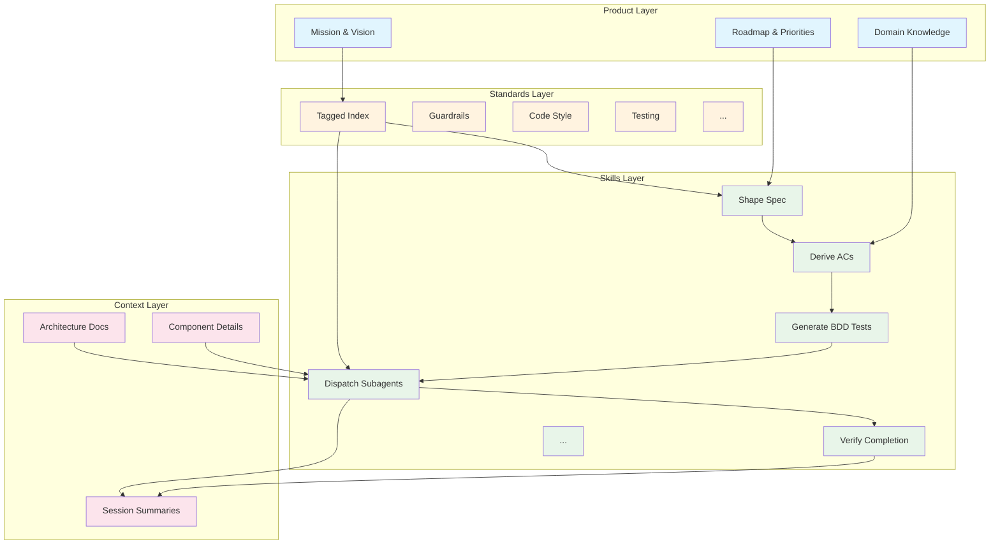
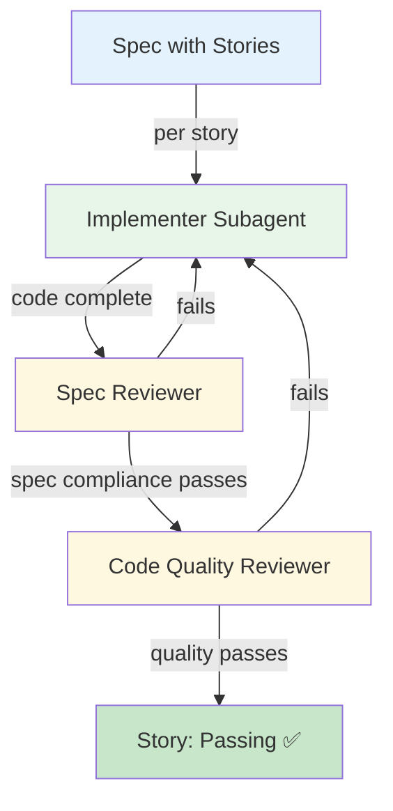

# Lit SDLC

**A file-based framework that makes AI coding agents reliable.**

AI agents write code fast but ship broken, inconsistent, incomplete work. They forget context between sessions, ignore conventions, skip testing, and declare "done" without evidence. Lit SDLC fixes this by wrapping the entire software development lifecycle in structured markdown and YAML files that agents read and follow — no runtime, no server, no dependencies. Just drop the files into your repo.

> **Meta note:** This repository uses Lit SDLC to manage its own development. The [product roadmap](agent-os/product/roadmap.md), [active specs](agent-os/specs/index.yml), and [session history](agent-os/context/sessions/) are all real artifacts produced by the framework's own workflows. What you see here is a working example.

---

## How It Works

Lit SDLC organizes everything an AI agent needs into four layers, each stored as plain files in your repository:



**Product** is the *why* — what you're building, for whom, and what matters now. **Standards** are the *what* — declarative conventions the agent must follow, indexed by tags so only relevant ones load. **Skills** are the *how* — step-by-step workflows the agent executes. **Context** is the *what happened* — architecture decisions, component knowledge, and session memory that persist across conversations.

Deep dive: [System Architecture](agent-os/context/architecture/system-overview.md) · [Mission](agent-os/product/mission.md) · [Terminology](agent-os/product/domain/terminology.md)

---

## The Development Lifecycle

A feature flows through a structured pipeline from idea to verified completion:

```mermaid
flowchart LR
    A["/start-session"] --> B["/shape-spec"]
    B --> C["/derive-acs"]
    C --> D["/generate-bdd-tests"]
    D --> E["/dispatch-subagents"]
    E --> F["/request-code-review"]
    F --> G["/verify-completion"]
    G --> H["/end-session"]

    style A fill:#e3f2fd,stroke:#1565c0
    style B fill:#e8f5e9,stroke:#2e7d32
    style C fill:#e8f5e9,stroke:#2e7d32
    style D fill:#e8f5e9,stroke:#2e7d32
    style E fill:#fff8e1,stroke:#f9a825
    style F fill:#fff8e1,stroke:#f9a825
    style G fill:#fce4ec,stroke:#c62828
    style H fill:#e3f2fd,stroke:#1565c0
```



Every session starts with `/start-session` (which loads priorities and active work) and ends with `/end-session` (which preserves context for the next conversation). In between, features progress through shaping, acceptance criteria, test scaffolding, implementation, review, and verification — each step enforced by its own skill.

The framework supports both **interactive mode** (developer present, fast iteration) and **unattended mode** (agent works autonomously with [strict guardrails](agent-os/standards/guardrails.md)).

---

## Discipline Enforcement

The framework's defining feature is that agents can't cut corners. Three mechanisms enforce this:

**Anti-rationalization tables** appear in every skill, listing the excuses agents commonly use to skip steps and why each excuse is wrong. For example, the testing skill anticipates "this code is too simple to test" and counters with specific guidance.

**Hard gates** are explicit blocking points. An agent cannot write code until the design is approved. It cannot claim a story is done until tests pass. The gates use `⛔ HARD GATE — DO NOT PROCEED` language that agents respect.

**Verification enforcement** requires agents to run actual commands, read real output, and cite specific evidence before claiming completion. No "I believe this works" — the [verify-completion](.claude/skills/agent-os/verify-completion/SKILL.md) skill demands proof.

Deep dive: [Business Rules](agent-os/product/domain/business-rules.md) · [Guardrails](agent-os/standards/guardrails.md)

---

## Subagent-Driven Development

For implementation, Lit SDLC dispatches fresh subagents per story with a two-stage review pipeline:



Each subagent starts with a clean context window loaded with only what it needs: the story's acceptance criteria, relevant standards, and architecture docs. The spec reviewer checks "did you build what was asked?" and the code quality reviewer checks "is the code well-built?" — catching different problem classes at each stage.

Deep dive: [Dispatch Subagents Skill](.claude/skills/agent-os/dispatch-subagents/SKILL.md) · [Code Review Skills](.claude/skills/agent-os/request-code-review/SKILL.md)

---

## Standards System

Standards are declarative convention documents indexed by tags. When an agent starts a task, it runs `/inject-standards` to load only the standards relevant to its current activity — a Go developer writing tests gets `code-style/go.md`, `testing.md`, and `bdd.md` but not `java.md` or `observability.md`. This keeps the agent's context window focused.

Standards tagged `[all]` (like [guardrails](agent-os/standards/guardrails.md) and [CSO rules](agent-os/standards/cso.md)) are always injected. Language-specific standards load only when that language is active.

| Standard | Tags | Purpose |
|----------|------|---------|
| [guardrails.md](agent-os/standards/guardrails.md) | `all` | Anti-patterns and unattended mode rules |
| [cso.md](agent-os/standards/cso.md) | `all` | Skill description rules (prevents the "Description Trap") |
| [best-practices.md](agent-os/standards/best-practices.md) | `coding`, `reviewing` | SOLID, YAGNI, TDD, error handling |
| [code-style.md](agent-os/standards/code-style.md) | `coding`, `reviewing` | Formatting conventions + language-specific guides |
| [testing.md](agent-os/standards/testing.md) | `coding`, `testing`, `reviewing` | TDD principles, coverage expectations |
| [bdd.md](agent-os/standards/bdd.md) | `testing`, `planning` | BDD conventions for Go (testify) and Java (Spock) |
| [git.md](agent-os/standards/git.md) | `committing` | Conventional commits, branch naming |
| [git-worktrees.md](agent-os/standards/git-worktrees.md) | `coding`, `committing` | Branch isolation for safe parallel work |

Full index: [standards/index.yml](agent-os/standards/index.yml)

---

## Spec Lifecycle

Features are tracked as specs with a defined lifecycle. Each spec contains requirements, architectural design, independently deliverable stories, and acceptance criteria in Given/When/Then format.

```
agent-os/specs/SPEC-001-feature-name/
├── README.md        # Scope, context, decisions, references
├── design.md        # Architecture and execution plan
├── stories.yml      # Story status tracking (failing → passing)
└── acs/             # Acceptance criteria per story
    ├── STORY-001-name.md
    └── coverage-matrix.md
```

Specs progress through: `in_requirements` → `in_design` → `in_progress` → `complete` → `archived`. Agents can only modify story status fields — they cannot add or remove stories, which prevents scope creep.

Active specs: [specs/index.yml](agent-os/specs/index.yml) · Example: [SPEC-001](agent-os/specs/SPEC-001-adopt-superpowers-discipline/README.md)

---

## All Skills

Skills are procedural workflows triggered via `/skill-name` commands. Each contains YAML frontmatter, anti-rationalization tables, optional hard gates, and step-by-step process instructions.

| Skill | When to Use |
|-------|-------------|
| [`/start-session`](.claude/skills/agent-os/start-session/SKILL.md) | **Always first** — loads priorities, context, active specs |
| [`/bootstrap`](.claude/skills/agent-os/bootstrap/SKILL.md) | New agent's first time on the project |
| [`/plan-product`](.claude/skills/agent-os/plan-product/SKILL.md) | Strategic planning, roadmap updates |
| [`/shape-spec`](.claude/skills/agent-os/shape-spec/SKILL.md) | New feature or significant change |
| [`/derive-acs`](.claude/skills/agent-os/derive-acs/SKILL.md) | Generate acceptance criteria from requirements |
| [`/generate-bdd-tests`](.claude/skills/agent-os/generate-bdd-tests/SKILL.md) | Transform ACs into test scaffolding (Go/Java) |
| [`/dispatch-subagents`](.claude/skills/agent-os/dispatch-subagents/SKILL.md) | Implement stories with fresh subagents |
| [`/request-code-review`](.claude/skills/agent-os/request-code-review/SKILL.md) | Two-stage review: spec compliance + code quality |
| [`/receive-code-review`](.claude/skills/agent-os/receive-code-review/SKILL.md) | Handle review feedback with rigor |
| [`/verify-completion`](.claude/skills/agent-os/verify-completion/SKILL.md) | **Before any completion claim** — evidence required |
| [`/continue-spec`](.claude/skills/agent-os/continue-spec/SKILL.md) | Resume work on an existing spec |
| [`/investigate`](.claude/skills/agent-os/investigate/SKILL.md) | Bugs, performance, behavior analysis |
| [`/inject-standards`](.claude/skills/agent-os/inject-standards/SKILL.md) | Load relevant standards for current task |
| [`/discover-standards`](.claude/skills/agent-os/discover-standards/SKILL.md) | Extract conventions from existing codebase |
| [`/index-standards`](.claude/skills/agent-os/index-standards/SKILL.md) | Rebuild the standards index |
| [`/end-session`](.claude/skills/agent-os/end-session/SKILL.md) | Context preservation, session summary |

---

## Repository Structure

```
lit-sdlc/
├── AGENTS.md                              # Agent onboarding — start here
├── CLAUDE.md                              # Claude Code configuration
├── README.md                              # This file
│
├── agent-os/
│   ├── product/                           # THE WHY
│   │   ├── mission.md                     # Problem, users, solution, differentiators
│   │   ├── roadmap.md                     # Phased roadmap, current focus, backlog
│   │   └── domain/
│   │       ├── terminology.md             # Framework vocabulary
│   │       └── business-rules.md          # Non-negotiable constraints
│   │
│   ├── standards/                         # THE WHAT
│   │   ├── index.yml                      # Tagged index for selective injection
│   │   ├── guardrails.md                  # Anti-patterns, unattended mode rules
│   │   ├── cso.md                         # Skill description rules
│   │   ├── best-practices.md              # SOLID, YAGNI, TDD
│   │   ├── code-style.md                  # Formatting conventions
│   │   ├── code-style/go.md               # Go-specific standards
│   │   ├── code-style/java.md             # Java-specific standards
│   │   ├── testing.md                     # TDD, coverage, test patterns
│   │   ├── bdd.md                         # BDD for Go (testify) and Java (Spock)
│   │   ├── git.md                         # Commit and branch conventions
│   │   ├── git-worktrees.md               # Branch isolation pattern
│   │   ├── observability.md               # Logging, metrics, tracing
│   │   └── tech-stack.md                  # Approved technologies
│   │
│   ├── specs/                             # FEATURE TRACKING
│   │   ├── index.yml                      # Master spec index
│   │   └── SPEC-001-adopt-superpowers-discipline/
│   │       ├── README.md                  # Spec overview
│   │       ├── design.md                  # Architecture + execution plan
│   │       └── stories.yml                # Story status tracking
│   │
│   ├── context/                           # THE WHAT HAPPENED
│   │   ├── architecture/
│   │   │   └── system-overview.md         # Four-layer architecture
│   │   ├── component-details/             # Per-component knowledge
│   │   └── sessions/                      # Session summaries
│   │
│   └── gaps.md                            # Known gaps and open questions
│
└── .claude/skills/agent-os/               # THE HOW (16 skills)
    ├── start-session/SKILL.md
    ├── end-session/SKILL.md
    ├── bootstrap/SKILL.md
    ├── shape-spec/SKILL.md
    ├── continue-spec/SKILL.md
    ├── derive-acs/SKILL.md
    ├── generate-bdd-tests/SKILL.md
    ├── dispatch-subagents/
    │   ├── SKILL.md
    │   ├── implementer-prompt.md
    │   ├── spec-reviewer-prompt.md
    │   └── code-quality-reviewer-prompt.md
    ├── request-code-review/SKILL.md
    ├── receive-code-review/SKILL.md
    ├── verify-completion/SKILL.md
    ├── investigate/SKILL.md
    ├── plan-product/SKILL.md
    ├── inject-standards/SKILL.md
    ├── discover-standards/SKILL.md
    └── index-standards/SKILL.md
```

---

## Quick Start

> A clean install script is [on the roadmap](agent-os/product/roadmap.md) (Phase 3). For now, manual setup:

1. Install [Claude Code](https://claude.com/product/claude-code) or [Cursor](https://cursor.com/)
2. Install [agent-os v3](https://buildermethods.com/agent-os/installation)
3. Copy the contents of this repository into your project root (excluding this README)
4. Customize [AGENTS.md](AGENTS.md) — areas marked `// TODO:` need your project's details
5. Populate product context using `/plan-product` and `/bootstrap`
6. Start building: `/start-session` → `/shape-spec` → implement → `/end-session`

---

## Current Status

Lit SDLC is actively developing itself using its own framework. Phase 1 (Foundation) and Phase 2 (Discipline Enforcement) are complete. Phase 3 (Distribution) is in progress — making the framework easy to install and adopt in new projects.

The [roadmap](agent-os/product/roadmap.md) tracks all phases. Known gaps and future work items are documented in [gaps.md](agent-os/gaps.md). The first spec, [SPEC-001: Adopt Superpowers Discipline Patterns](agent-os/specs/SPEC-001-adopt-superpowers-discipline/README.md), added anti-rationalization tables, hard gates, verification enforcement, subagent-driven development, two-stage code review, CSO rules, and git worktree standards — all inspired by analysis of the [Superpowers](https://github.com/NickBaynworker/superpowers) framework.

---

## Contributing

The [gaps.md](agent-os/gaps.md) file documents every known gap, open question, and missing workflow. If you want to contribute, that's the best place to find meaningful work. PRs and ideas are welcome.

---

## Key Links

| Resource | Description |
|----------|-------------|
| [AGENTS.md](AGENTS.md) | Agent onboarding and workflow reference |
| [Mission](agent-os/product/mission.md) | Why this exists |
| [Roadmap](agent-os/product/roadmap.md) | Where it's going |
| [Architecture](agent-os/context/architecture/system-overview.md) | How it's built |
| [Terminology](agent-os/product/domain/terminology.md) | Framework vocabulary |
| [Business Rules](agent-os/product/domain/business-rules.md) | Non-negotiable constraints |
| [Standards Index](agent-os/standards/index.yml) | All conventions, tagged |
| [Gaps](agent-os/gaps.md) | Known gaps and open questions |
| [Specs](agent-os/specs/index.yml) | Active feature work |
| [agent-os v3](https://github.com/buildermethods/agent-os) | Upstream framework |
