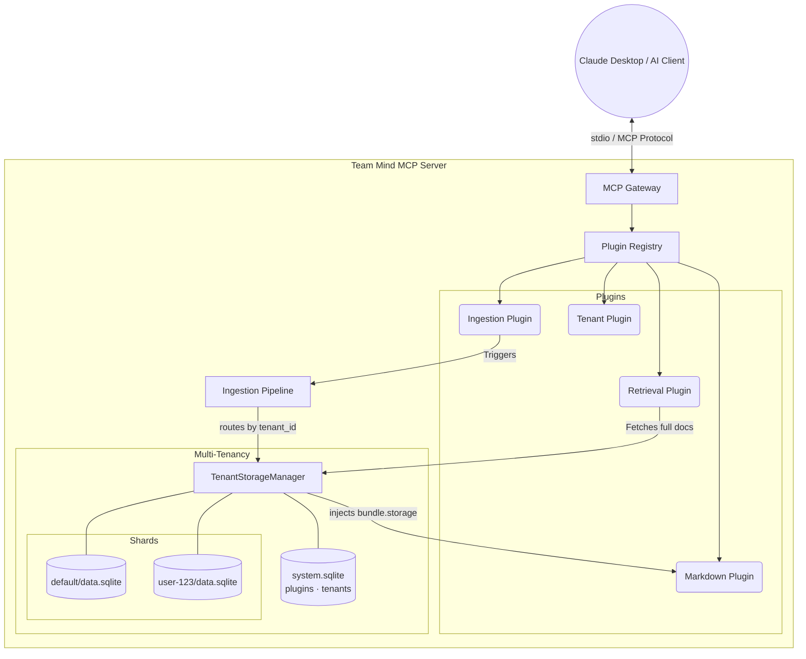

# Team Mind

Team Mind is a collaborative AI knowledge engine built on the Model Context Protocol (MCP). It provides a persistent, decentralized "brain" that allows AI agents and development teams to share context, ingest documents, and execute semantic searches.

## Architecture & Data Flow

At its core, Team Mind operates as an extensible MCP Server. The architecture separates the communication layer from the storage and ingestion mechanisms, allowing for flexible plugin-based capabilities.



### Core Components

- **MCP Gateway**: Handles the standard MCP protocol lifecycle and routing between the connected AI client (e.g., Claude) and the internal registry.
- **Plugin Registry**: Manages registered tools (`ToolProvider`), ingestion processors (`IngestProcessor`), and ingestion observers (`IngestObserver`).
- **Ingestion Pipeline**: A two-phase event-driven loop that resolves URIs, broadcasts bundles to processors (Phase 1), then notifies observers with structured events (Phase 2).
- **Storage Adapter**: An embedded SQLite database utilizing the `sqlite-vec` extension for high-performance semantic vector search and `json1` for metadata.

## Usage

Team Mind is built with `uv` and exposes a unified CLI entry point.

### Starting the Server

To start the MCP Server and connect it to a client:

```bash
# Starts the stdio server (defaults to ~/.team-mind/database.sqlite)
uv run team-mind-mcp start

# Override the database location
uv run team-mind-mcp --db-path ./my-project-brain.sqlite start
```

### Offline Bulk Ingestion

You can seamlessly pre-load the database with context from local files, entire directories, or remote URIs using the `ingest` subcommand without starting the server:

```bash
# Ingest diverse targets simultaneously
uv run team-mind-mcp ingest ./docs/ https://example.com/api.md ./notes.txt

# Ingest into a specific tenant shard
uv run team-mind-mcp ingest --tenant-id user-123 ./user-docs/
```

### Live Agent Ingestion

When the server is running, connected AI agents have access to the `ingest_documents` tool. This allows them to dynamically pull in web links or local file paths during a conversation, expanding their context dynamically!

## Building Plugins

Want to extend Team Mind with a new plugin? See the **[Plugin Developer Guide](agent-os/context/architecture/plugin-developer-guide.md)** — it covers what you own (record types, metadata schemas, storage modes, tools), what the platform provides, and includes runnable code examples.

## Development Status

- **Phase 1: Core Engine** - **COMPLETE**
  - SPEC-001: MCP Gateway, SQLite storage, ingestion pipeline, Markdown plugin, CLI
  - SPEC-002: Doctype system, plugin-scoped namespacing, scoped queries, discovery tool
  - SPEC-003: IngestProcessor/IngestObserver split, two-phase pipeline, IngestionEvent
- **Phase 2: Intelligence & Weighting** - **COMPLETE**
  - SPEC-004: Usage-based ranking (cumulative average), information decay, tombstoning, doc updates
  - SPEC-005: Idempotent ingestion (content hashing, plugin versioning, IngestionContext)
  - SPEC-006: Plugin lifecycle management (dynamic registration, filtered subscriptions, persistence)
  - SPEC-007: Reliability seeding — three-layer initial score model (ingest hint > plugin default > 0.0)
  - SPEC-008: Semantic type routing — three-type model (semantic/media/record type), registration-time routing, available vs enabled activation model
  - SPEC-009: Record type rename (`doctype` → `record_type`) throughout codebase
- **Phase 3: Reliability & Extensibility** - **IN PROGRESS**
  - SPEC-010: Multi-tenancy & metadata search — per-tenant SQLite sharding, `TenantStorageManager`, scatter-gather cross-tenant queries, metadata filters via `json_extract`, optional vector query — **COMPLETE**

---

> **Note:** This project uses [Lit SDLC](https://github.com/buildermethods/lit-sdlc) for structured AI-assisted development. See `AGENTS.md` for the internal workflow.
