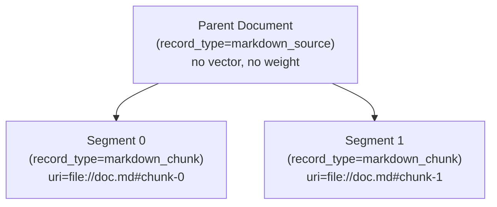

# Plugin Developer Guide

> How to build plugins for Team Mind. This is the starting point for anyone extending the system.

## What You Control

When you build a plugin, you own:

1. **Your record types** — You declare what types of documents your plugin produces (e.g., `user_interest`, `trip_review`, `code_signature`). These are namespaced to your plugin automatically (`your_plugin:your_record_type`), so you'll never collide with other plugins.

2. **Your metadata schema** — The `metadata` JSON column is yours. Store whatever structure you need per document — free-form fields, nested objects, arrays. You declare an advisory schema so other plugins can understand your data, but it's your design.

3. **Your storage mode per document** — For each document you ingest, you choose:
   - **Pointer mode**: Store a URI reference. The content lives externally (file, URL, API) and is fetched live on demand. Best for stable, long-lived sources.
   - **Embedded mode**: Store the full content directly in the `metadata` JSON under a `local_payload` key. Best for ephemeral content, user input, or anything without a stable external URL.
   - You can mix both modes freely within the same record type.

4. **Your MCP tools** — You define what tools AI agents can call and what those tools do. Tools are your plugin's public API.

5. **Your ingestion logic** — You decide which URIs from a bundle are relevant, how to process them, how to chunk/transform content, and what to store.

6. **Your observation reactions** — You decide what to do when other plugins finish ingesting (auditing, notifications, cross-plugin triggers).

## What the Platform Provides

You don't build these — they're shared infrastructure:

- **The `documents` table** — A per-tenant table with columns: `id`, `uri`, `plugin`, `record_type`, `metadata` (JSON). Your plugin writes rows tagged with your plugin name and record type. Other plugins can read your data by querying your record type.
- **The `vec_documents` table** — Vector embeddings linked to document rows. Used for semantic (KNN) search.
- **The `doc_weights` table** — Per-document relevance scores, decay configuration, and tombstone flag. Platform-managed.
- **The `PluginRegistry`** — Handles registration, tool routing, and record type catalog. You register; it routes.
- **The `IngestionPipeline`** — Two-phase pipeline: broadcasts bundles to processors (Phase 1), then notifies observers with structured events (Phase 2). Injects the correct per-tenant `StorageAdapter` into `bundle.storage` before calling your processor.
- **The `TenantStorageManager`** — Manages per-tenant SQLite databases. Plugins never interact with this directly — the pipeline resolves the correct adapter and injects it via `bundle.storage`.
- **Cross-plugin queries** — Any plugin can query by `plugins` and/or `record_types` lists. If your data is useful to others, they can discover it via `list_record_types` and query it via `semantic_search`.

### Tenant Transparency

**Plugins are tenant-unaware by design.** Your `process_bundle` method receives a `bundle` with `bundle.storage` already pointing to the correct per-tenant `StorageAdapter`. You write to `bundle.storage` — the pipeline and `TenantStorageManager` handle all tenant routing.

You will never see `TenantStorageManager` in your plugin code. Tenant routing is a pipeline/manager concern, not a plugin concern.

## Plugin Interfaces

There are three interfaces. Pick any combination depending on what your plugin does:

| Interface | Role | When to use |
|-----------|------|-------------|
| **ToolProvider** | Expose tools to AI clients | You want AI agents to call your plugin's functionality |
| **IngestProcessor** | Do ingestion work (parse, chunk, store) | You want to process raw URIs and write documents to storage |
| **IngestObserver** | React to completed ingestion | You want to know when other plugins have finished ingesting (audit, notify, trigger) |

Common combinations:

| Pattern | Example | Use Case |
|---------|---------|----------|
| ToolProvider only | `DocumentRetrievalPlugin` | Query/action tools, no ingestion |
| IngestProcessor only | *(future)* Metrics collector | Silently processes documents |
| IngestObserver only | *(future)* Audit plugin | Reacts when ingestion completes |
| ToolProvider + IngestProcessor | `MarkdownPlugin` | Ingests AND exposes search tools |
| ToolProvider + IngestObserver | *(future)* Dashboard plugin | Tools AND reacts to ingestion |

### ToolProvider — Expose tools to AI clients

```python
from team_mind_mcp.server import ToolProvider, RecordTypeSpec
from mcp.types import Tool, TextContent

class MyPlugin(ToolProvider):
    @property
    def name(self) -> str:
        return "my_plugin"

    @property
    def record_types(self) -> list[RecordTypeSpec]:
        return [
            RecordTypeSpec(
                name="my_data_type",
                description="What this document type represents.",
                schema={
                    "field_a": {"type": "string", "description": "..."},
                    "field_b": {"type": "integer", "description": "..."},
                }
            )
        ]

    def get_tools(self) -> list[Tool]:
        return [
            Tool(
                name="my_tool",
                description="What this tool does.",
                inputSchema={
                    "type": "object",
                    "properties": {
                        "query": {"type": "string"}
                    },
                    "required": ["query"]
                }
            )
        ]

    async def call_tool(self, name: str, arguments: dict) -> list[TextContent]:
        if name == "my_tool":
            # Your logic here
            return [TextContent(type="text", text="result")]
        raise ValueError(f"Unknown tool: {name}")
```

### IngestProcessor — Process incoming documents

Processors receive raw URIs, do the heavy lifting (parsing, chunking, embedding), write to storage, and return `IngestionEvent` objects describing what they wrote.

```python
from team_mind_mcp.server import IngestProcessor, RecordTypeSpec
from team_mind_mcp.ingestion import IngestionBundle, IngestionEvent

class MyIngestionPlugin(IngestProcessor):
    # No storage injected in constructor — the pipeline injects it via bundle.storage

    @property
    def name(self) -> str:
        return "my_ingestion_plugin"

    @property
    def record_types(self) -> list[RecordTypeSpec]:
        return [
            RecordTypeSpec(
                name="processed_item",
                description="An item extracted during ingestion.",
                schema={"content": {"type": "string"}}
            )
        ]

    async def process_bundle(self, bundle: IngestionBundle) -> list[IngestionEvent]:
        doc_ids = []
        processed_uris = []

        for uri in bundle.uris:
            if not self._is_relevant(uri):
                continue

            processed_uris.append(uri)
            content = self._fetch_and_process(uri)
            vector = self._generate_embedding(content)

            # Use bundle.storage — the pipeline has already resolved the correct
            # per-tenant StorageAdapter. Never use self.storage in process_bundle.

            # Pointer mode: store URI reference, fetch content on demand
            doc_id = bundle.storage.save_payload(
                uri=uri,
                metadata={"summary": content[:200]},
                vector=vector,
                plugin=self.name,
                record_type="processed_item"
            )
            doc_ids.append(doc_id)

            # OR Embedded mode: store full content in metadata
            doc_id = bundle.storage.save_payload(
                uri=uri,
                metadata={"local_payload": content, "summary": content[:200]},
                vector=vector,
                plugin=self.name,
                record_type="processed_item"
            )
            doc_ids.append(doc_id)

        # Return events describing what you wrote
        if processed_uris:
            return [IngestionEvent(
                plugin=self.name,
                record_type="processed_item",
                uris=processed_uris,
                doc_ids=doc_ids
            )]
        return []
```

### IngestObserver — React to completed ingestion

Observers don't process raw URIs. They receive structured `IngestionEvent` objects **after** all processors have finished, describing what was written. Use this for auditing, notifications, cross-plugin triggers, or any reaction to "something was just ingested."

```python
from team_mind_mcp.server import IngestObserver
from team_mind_mcp.ingestion import IngestionEvent

class AuditPlugin(IngestObserver):
    @property
    def name(self) -> str:
        return "audit_plugin"

    async def on_ingest_complete(self, events: list[IngestionEvent]) -> None:
        for event in events:
            if event.plugin == "java_plugin" and event.record_type == "code_signature":
                # Java code was updated — trigger compliance audit
                await self._run_audit(event.uris, event.doc_ids)
```

**What's in an IngestionEvent:**
```python
@dataclass
class IngestionEvent:
    plugin: str          # Which processor wrote the data
    record_type: str     # What record type was written
    uris: list[str]      # Which source URIs were processed
    doc_ids: list[int]   # IDs of the document rows created
    tenant_id: str       # Which tenant shard was written to (default: "default")
```

### Combining interfaces

```python
# Ingest AND expose tools (like MarkdownPlugin)
class MyFullPlugin(ToolProvider, IngestProcessor):
    # Implement: name, record_types, get_tools, call_tool, process_bundle
    ...

# Tools AND react to ingestion
class MyDashboard(ToolProvider, IngestObserver):
    # Implement: name, get_tools, call_tool, on_ingest_complete
    ...
```

## The Two-Phase Ingestion Pipeline

When documents are ingested, the pipeline runs in two phases:

```
Phase 1 — Processing (parallel):
  Raw URIs → IngestionBundle → broadcast to all IngestProcessors
  → Each processor writes documents, returns IngestionEvents

Phase 2 — Observation (parallel, after Phase 1 completes):
  Collected IngestionEvents → broadcast to all IngestObservers
  → Each observer reacts to what was written
```

**Key guarantee:** Observers never run until all processors have finished. When your observer receives events, the data is committed and queryable.

## Storage: How Your Data Lives in the Database

The `documents` table is shared, but your data is yours:

```
┌──────────────────────────────────────────────────────────────────────┐
│                          documents table                             │
├────┬──────────────────┬───────────────────┬─────────────┬───────────┤
│ id │ uri              │ plugin            │ record_type │ metadata  │
├────┼──────────────────┼───────────────────┼─────────────┼───────────┤
│  1 │ file:///doc.md   │ markdown_plugin   │ md_chunk    │ {chunk…}  │
│  2 │ file:///doc.md   │ markdown_plugin   │ md_chunk    │ {chunk…}  │
│  3 │ user://input     │ travel_plugin     │ interest    │ {local…}  │
│  4 │ https://dest.com │ travel_plugin     │ dest_info   │ {name…}   │
│  5 │ file:///code.py  │ ast_plugin        │ signature   │ {func…}   │
└────┴──────────────────┴───────────────────┴─────────────┴───────────┘

 Your plugin's rows are scoped by the `plugin` and `record_type` columns.
 Other plugins can query your data by record_type, but you own it.
```

**Key points:**
- The `plugin` column is always set to your plugin's `name` property. This is automatic ownership.
- The `record_type` column is whatever you declared in your `record_types` property. One plugin can have multiple record types.
- The `metadata` column is a JSON blob — you define its shape. Your record type's `schema` tells others what to expect, but it's not enforced (advisory only).
- The `uri` column identifies the source. For embedded content, it can be any identifier you choose (e.g., `user://preferences/hiking`).

## Querying Data (Yours or Other Plugins')

```python
# Query your own data
results = storage.retrieve_by_vector_similarity(
    vector, limit=10,
    plugins=["my_plugin"],
    record_types=["my_data_type"]
)

# Query another plugin's data (cross-plugin)
results = storage.retrieve_by_vector_similarity(
    vector, limit=10,
    plugins=["travel_plugin"],
    record_types=["interest", "dest_info"]
)

# Query across all plugins (no filters)
results = storage.retrieve_by_vector_similarity(vector, limit=10)
```

All filter parameters accept **lists**, so you can query multiple plugins and record types in a single call.

### Metadata Filters

The `metadata` JSON column is queryable at search time through optional equality filters:

```python
results = storage.retrieve_by_vector_similarity(
    vector, limit=10,
    metadata_filters={"interest_category": "sports", "league": "nfl"}
)
# → WHERE json_extract(metadata, '$.interest_category') = 'sports'
#     AND json_extract(metadata, '$.league') = 'nfl'
```

Metadata filters compose with `plugins` and `record_types` filters. All filter keys must match `^[A-Za-z0-9_]+$` (alphanumeric and underscores only).

**Optional vector query:** When the caller omits `target_vector`, the storage layer queries the `documents` table directly without a KNN join and ranks results by composite weight score (`usage_score * decay`) descending. All metadata, plugin, and record_type filters still apply.

### Structural Fields vs. Metadata Fields

This distinction determines what you should put in first-class columns vs. what goes in the `metadata` JSON:

| | First-class columns | Metadata fields |
|---|---|---|
| **Purpose** | Framework routing, identity, system behavior | Domain-specific attributes for query-time filtering |
| **Who controls** | Framework / pipeline | Your plugin |
| **Examples** | `plugin`, `record_type`, `semantic_type`, `media_type` | `interest_category`, `league`, `destination`, `price_range` |
| **How to filter** | Dedicated WHERE clause (fast, indexed) | `json_extract` (per-query) |

**The rule:** If the framework/pipeline needs it to make routing or identity decisions, it's a column. If only your plugin's consumers need it at query time for filtering, it belongs in `metadata`.

## Understanding the Three-Type Model

SPEC-008 (ADR-007) introduces three distinct type concepts. If you're building a processor, you need to understand all three:

| Type | What it answers | Set by | Example |
|------|----------------|--------|---------|
| **Semantic type** | "What does this data *mean*?" | Ingestion caller | `architecture_docs`, `payment_service` |
| **Media type** | "How is this data *encoded*?" | Plugin (auto-detected) | `text/markdown`, `text/x-java` |
| **Record type** | "What did the plugin *produce*?" | Plugin, at write time | `markdown_chunk`, `code_signature` |

Previously called `doctype`, record type is the plugin-scoped output concept. Semantic type and media type are new columns on `documents` added in SPEC-008.

## Available vs Enabled: Activation Model

Registered plugins exist in one of two states:

| State | Registered? | Has semantic types? | Processes content? |
|-------|------------|--------------------|--------------------|
| **Available** | Yes | No | No — idle |
| **Enabled** | Yes | Yes (specific types or `*`) | Yes, for matching types |

**Key rule: no semantic types = no processing.** A registered plugin with no semantic type associations is available but idle. This is intentional — newly installed plugins don't automatically process all content. An admin must explicitly enable processing for specific semantic types.

`["*"]` is a wildcard that opts the plugin into processing all semantic types (respecting media type filtering). It must be explicitly configured — it is not the default.

## Declaring Your Media Type Capabilities

Processors declare which media types they can handle:

```python
class MyPlugin(IngestProcessor):
    @property
    def supported_media_types(self) -> list[str]:
        return ["text/markdown", "text/plain"]
```

Even in wildcard mode, your plugin only receives URIs matching these media types. Media type is auto-detected from file extension or can be explicitly hinted by the ingestion caller.

## Registering Your Plugin

There are two ways to register plugins:

### Compile-time registration (core plugins)

Core plugins are registered in `cli.py` at server startup. You can optionally provide `semantic_types` to enable the plugin immediately:

```python
# Available but idle (no semantic types):
gateway.registry.register(markdown_plugin)

# Available and enabled for specific semantic types:
gateway.registry.register(markdown_plugin, semantic_types=["architecture_docs", "meeting_transcripts"])
```

### Runtime registration (dynamic plugins)

Plugins can be registered at runtime via the `register_plugin` MCP tool — no server restart needed:

```python
# Register and enable for specific semantic types:
register_plugin(
    module_path="my_plugins.travel.TravelPlugin",
    semantic_types=["travel_profile", "booking_data"]
)

# Register as available-only (no ingestion routing yet):
register_plugin(module_path="my_plugins.travel.TravelPlugin")
```

Dynamically registered plugins:
- Are persisted to the `registered_plugins` table — they survive restarts
- Can be unregistered via `unregister_plugin(plugin_name)`
- Can be listed via `list_plugins()`

### What happens on registration:
- Your tools are added to the MCP tool catalog (visible to AI clients).
- Your record types are added to the record type catalog (discoverable via `list_record_types`).
- If you implement `IngestProcessor` **and** have semantic types configured, you receive bundles for those types during ingestion.
- If you implement `IngestObserver`, you start receiving events after ingestion completes.

### Event subscriptions for observers

By default, observers receive **all** ingestion events (fire hose). To subscribe to specific events only, override the `event_filter` property. SPEC-008 adds `semantic_types` filtering so observers can react to domain-level events:

```python
from team_mind_mcp.server import IngestObserver, EventFilter

class AuditPlugin(IngestObserver):
    @property
    def event_filter(self) -> EventFilter | None:
        # Only care about architecture docs, regardless of which plugin processed them
        return EventFilter(
            semantic_types=["architecture_docs"]
        )

    async def on_ingest_complete(self, events):
        # Receives events where any semantic_type matches "architecture_docs"
        for event in events:
            await self._run_audit(event.uris)
```

| Pattern | event_filter returns | What the observer receives |
|---------|---------------------|--------------------------|
| Fire hose | `None` (default) | Every event from every processor |
| Semantic type filter | `EventFilter(semantic_types=["architecture_docs"])` | Events where any semantic type matches |
| Plugin filter | `EventFilter(plugins=["java_plugin"])` | Only events from that plugin |
| Record type filter | `EventFilter(record_types=["code_signature"])` | Only events with that record type |
| Combined | `EventFilter(plugins=[...], record_types=[...], semantic_types=[...])` | Events matching all specified filters |

Semantic type filtering uses ANY-match semantics: an event passes if any of its `semantic_types` values appears in the filter's `semantic_types` list.

## Reliability Seeding

When a document is first saved, its `usage_score` in `doc_weights` is seeded to a caller-supplied or plugin-declared quality value. This is the **three-layer reliability model** introduced in SPEC-007.

### The Three Layers (highest priority wins)

| Layer | Source | How |
|-------|--------|-----|
| **1. Ingest hint** | Ingestion caller | `reliability_hint` parameter on `ingest_documents` MCP tool or `ingest --reliability` CLI flag |
| **2. Plugin default** | `RecordTypeSpec.default_reliability` | Declared on the record type at plugin definition time |
| **3. Platform default** | `0.0` | Used when neither of the above is provided |

The plugin is responsible for resolving these layers in `process_bundle` and passing the result as `initial_score` to `save_payload`.

### How to implement it in your plugin

```python
from team_mind_mcp.server import IngestProcessor, RecordTypeSpec
from team_mind_mcp.ingestion import IngestionBundle

class MyPlugin(IngestProcessor):
    @property
    def record_types(self) -> list[RecordTypeSpec]:
        return [
            RecordTypeSpec(
                name="my_record_type",
                description="A record produced by my plugin.",
                schema={"content": {"type": "string"}},
                default_reliability=0.7,  # Layer 2: plugin-declared default
            )
        ]

    async def process_bundle(self, bundle: IngestionBundle) -> list[IngestionEvent]:
        # Resolve reliability: Layer 1 (hint) > Layer 2 (default) > Layer 3 (0.0)
        hint = bundle.reliability_hint          # float | None from the caller
        default = 0.7                           # your RecordTypeSpec.default_reliability
        initial_score = hint if hint is not None else (default if default is not None else 0.0)

        for uri in bundle.uris:
            content = self._fetch_and_process(uri)
            vector = self._generate_embedding(content)

            # Use bundle.storage — the pipeline injects the correct per-tenant adapter
            doc_id = bundle.storage.save_payload(
                uri=uri,
                metadata={"content": content},
                vector=vector,
                plugin=self.name,
                record_type="my_record_type",
                initial_score=initial_score,   # Layer resolution result
            )
```

### What `initial_score` does

`initial_score` seeds `usage_score` in the `doc_weights` table when the document is first created. The `signal_count` remains `0`, so the first real feedback signal will average in normally. Documents with a higher initial score rank higher in search results immediately after ingestion — before any feedback arrives.

- `initial_score=0.0` (default) — no bias; ranking is purely by vector distance.
- `initial_score=0.8` — document gets a moderate quality head start in rankings.
- `initial_score=1.0` — maximum initial boost.

### Caller-side usage

**Via MCP tool:**
```json
{
  "tool": "ingest_documents",
  "arguments": {
    "uris": ["file:///path/to/doc.md"],
    "semantic_types": ["architecture_docs"],
    "reliability_hint": 0.9
  }
}
```

**Via CLI:**
```bash
uv run team-mind ingest --reliability 0.9 /path/to/doc.md
```

## Integration Options Summary

Team Mind plugins support a wide array of integration patterns:

| Capability | Options |
|-----------|---------|
| **Interfaces** | `ToolProvider`, `IngestProcessor`, `IngestObserver` — any combination |
| **Registration** | Compile-time (hardcoded in cli.py) or runtime (via `register_plugin` MCP tool) |
| **Activation** | Available (no semantic types = idle) or enabled (specific types or `["*"]` wildcard) |
| **Routing** | Semantic type routing — processors receive only URIs for their registered semantic types |
| **Media type filtering** | Declare `supported_media_types`; only matching URIs are routed to your plugin |
| **Observation mode** | Fire hose (all events) or topic-based (filtered by plugin/record_type/semantic_type) |
| **Storage mode** | Pointer (URI reference) or embedded (`local_payload` in metadata) |
| **Idempotent ingestion** | Content hashing, plugin versioning, `IngestionContext` per URI |
| **Relevance weighting** | Decay policy per record type, feedback signals, tombstoning |
| **Reliability seeding** | Three-layer initial score (ingest hint > plugin default > 0.0) via `initial_score` on `save_payload` |
| **Document updates** | In-place (`update_payload`) or wipe-and-replace (`delete_by_uri`) |

## Relevance Weighting (Platform-Managed)

The platform automatically manages relevance weighting for all plugins. You don't implement scoring — the platform does it for you. Your documents gain or lose value based on AI/human feedback and time-based decay.

### What you get for free

- **Usage-based ranking**: When an AI agent or human calls `provide_feedback(doc_id, signal)`, the platform updates the document's score. Higher-scored documents rank higher in search results.
- **Composite scoring**: Search results are ranked by `final_rank = vector_distance - (usage_score * weight_influence * decay_factor)`, not just vector distance alone.
- **Tombstoning**: Bad documents can be flagged out of all search results without being deleted.

### What you control: Decay policy

Declare `decay_half_life_days` on your `RecordTypeSpec` to control how fast your data's boost decays over time:

```python
RecordTypeSpec(
    name="meeting_notes",
    description="Notes from team meetings.",
    decay_half_life_days=30,     # Loses half its boost every 30 days
)

RecordTypeSpec(
    name="code_signature",
    description="Function signatures from source code.",
    decay_half_life_days=None,   # No decay — code doesn't age
)
```

- `None` (default) = no decay. Usage score stays at full value forever.
- A number = half-life in days. After that many days, the effective score is halved.

### How scoring works

| What | Who does it | How |
|------|-------------|-----|
| Feedback signals | AI agents / humans via `provide_feedback` MCP tool | `signal` from -5 (strongly demote) to +5 (strongly promote) |
| Score accumulation | Platform | Signals are **averaged**: each new signal is folded into the running average proportionally |
| Decay | Platform, at query time | `effective_score = usage_score * 0.5^(days_old / half_life)` |
| Tombstone | AI agents / humans via `provide_feedback(tombstone=true)` | Document excluded from all search results, reversible |

### What if you don't care about weighting?

Don't set `decay_half_life_days`. Don't call `provide_feedback`. Your documents get `usage_score=0.0`, `decay_factor=1.0`, and results are ranked by **pure vector distance** — identical to a system with no weighting at all.

### The `doc_weights` table

Each document gets one row in `doc_weights` (auto-created when the document is saved):

```
doc_weights
├── doc_id          → FK to documents
├── usage_score     → Running average of feedback signals (starts at 0.0)
├── signal_count    → Number of signals received (for averaging math)
├── created_at      → When the doc was ingested
├── last_accessed   → Last feedback timestamp
├── tombstoned      → 0 or 1
└── decay_half_life_days → Copied from RecordTypeSpec (nullable)
```

There is **one row per document**, not one row per feedback event. The running average is maintained via `signal_count` — no compaction or aggregation needed at scale.

### Idempotent ingestion (content hashing & plugin versioning)

When the pipeline broadcasts a bundle, it provides an `IngestionContext` for each URI in `bundle.contexts[uri]`. This tells your processor whether the URI has been ingested before, whether the content changed, and whether your plugin version has changed:

```python
async def process_bundle(self, bundle: IngestionBundle) -> list[IngestionEvent]:
    for uri in bundle.uris:
        ctx = bundle.contexts.get(uri)

        if ctx and ctx.is_update:
            # We've seen this URI before
            current_hash = hashlib.sha256(content.encode()).hexdigest()

            if ctx.previous_content_hash == current_hash and not ctx.plugin_version_changed:
                continue  # Nothing changed — skip

            # Content or version changed — wipe and re-ingest
            bundle.storage.delete_by_uri(uri, plugin=self.name, record_type="my_type")

        # Process and save with hash + version
        doc_id = bundle.storage.save_payload(
            uri, metadata, vector,
            plugin=self.name, record_type="my_type",
            content_hash=current_hash, plugin_version=self.version,
        )
```

**Plugin decision matrix:**

| is_update | content_changed | version_changed | Typical action |
|-----------|----------------|-----------------|----------------|
| false | N/A | N/A | Fresh insert |
| true | false | false | Skip (nothing changed) |
| true | true | false | Wipe and replace |
| true | false | true | Re-process (plugin logic changed) |
| true | true | true | Wipe and replace |

**Declaring your plugin version:**

```python
class MyPlugin(IngestProcessor):
    @property
    def version(self) -> str:
        return "1.0.0"  # Bump when your processing logic changes
```

Default is `"0.0.0"`. The platform stores this with every document so future versions of your plugin can detect docs processed by older logic.

### Updating and replacing documents

The platform provides two methods for keeping data current:

**Update a specific chunk in place** (preserves its weight):
```python
# Plugin knows the doc_id of the chunk it wants to update
bundle.storage.update_payload(
    doc_id=42,
    metadata={"chunk": "updated content", "version": 2},
    vector=new_embedding
)
# uri, plugin, record_type, and usage_score are all preserved
```

**Wipe and re-ingest a whole document** (fresh start):
```python
# Delete all old chunks for this URI, then re-ingest
deleted = bundle.storage.delete_by_uri(
    uri="file:///doc.md",
    plugin=self.name,
    record_type="markdown_chunk"
)
# Now insert new chunks — they start with usage_score=0.0
for chunk in new_chunks:
    bundle.storage.save_payload(uri, chunk_meta, vector, plugin=self.name, record_type="markdown_chunk")
```

`delete_by_uri` is scoped to your plugin and record type — it won't touch another plugin's data for the same URI. Deletion removes the document, vector, and weight rows together.

**Which to use:** If your chunks have stable identities (e.g., a user preference by ID), use `update_payload`. If the document's structure changes on update (paragraphs added/removed), use wipe-and-replace.

### Score averaging (not additive)

Scores use a **cumulative moving average**, not simple addition. Each new signal is averaged into the existing score proportionally:

```
new_count = old_count + 1
new_score = old_score + (signal - old_score) / new_count
```

This means:
- After 100 signals of +5, the average is 5.0
- One person comes along and gives -5 → average becomes ≈ 4.9 (barely moves)
- The score naturally stays bounded to [-5, +5] (the signal range) with no artificial clamping
- Every signal gets proportional weight — early signals and late signals are treated fairly

The `doc_weights` table tracks `signal_count` alongside `usage_score` to maintain the running average.

### URIs for embedded content

When storing content in embedded mode (`local_payload`), the URI is just a **string identifier** — it doesn't need to point to a real file or URL. Use any scheme that makes sense for your data:

```python
# These are all valid URIs for embedded content:
"user://preferences/hiking"
"chat://session-123/msg-5"
"virtual://generated-summary-42"
"api://weather/2026-03-25"
```

The URI serves as a logical identifier for `delete_by_uri` and `get_full_document` lookups regardless of storage mode.

### Chunks are a plugin concept, not a core concept

The platform has no concept of "chunks." Every row in the `documents` table is just a document — the platform doesn't know or care whether a row represents a whole file, a paragraph, a sentence, or a function signature. If your plugin splits a source file into 10 chunks, that's 10 document rows. If another plugin stores one row per file, that's fine too. The platform treats all rows identically.

## Working with Segments (SPEC-011)

SPEC-011 (ADR-009) formalizes the **parent-child relationship** for plugins that split a logical document into multiple independently-weighted rows. This pattern is called **document segmentation**.

### When to use segments

Use segments when your plugin splits a single logical source (a file, a user profile, an API response) into multiple independently-searchable and independently-ratable rows. Examples:

- A markdown file split into paragraph-level chunks
- A user's travel preferences stored as individual interest atoms
- A code file parsed into per-function signature rows

If your plugin stores one row per source, you don't need segments — standalone documents (`parent_id = NULL`) are unchanged.

### Parent-child hierarchy



- **Parent document**: Has a URI, record type, and metadata. No vector embedding — it is not searchable in KNN. No `doc_weights` row — its score is derived from its children's aggregate.
- **Segments (children)**: Each has its own URI, vector embedding, and weight. These are the units of retrieval and rating. `parent_id` links them back to the parent.

### Creating parents and segments

```python
# Create parent document for the source file
parent_id = storage.save_parent(
    uri=uri,
    plugin=self.name,
    record_type="document_source",
    metadata={"source_uri": uri, "chunk_count": len(chunks)},
    content_hash=content_hash,
    plugin_version=self.version,
)

# Create child segments with parent_id
for i, chunk in enumerate(chunks):
    storage.save_payload(
        uri=f"{uri}#chunk-{i}",
        metadata={"chunk": chunk},
        vector=embed(chunk),
        plugin=self.name,
        record_type="document_chunk",
        parent_id=parent_id,   # links segment to parent
    )
```

`save_parent` creates a document row with no vector and no weight entry. It returns the `doc_id` for segments to reference via `parent_id`.

### Wipe-and-replace with segments

When re-ingesting an existing source, delete by the parent's URI — the platform cascades the deletion to all child segments:

```python
# Target the parent — cascade delete handles children
storage.delete_by_uri(uri, plugin=self.name, record_type="document_source")
```

After deletion, re-ingest as normal: create a new parent, then new segments.

### Backward compatibility

`parent_id` defaults to `NULL`. Plugins that do not use segments are completely unaffected — their rows are standalone documents and all existing query behavior is unchanged. Segments are opt-in.

### Segment navigation

Search results include a `parent_id` field. When `parent_id` is non-null, the client knows the result is a segment and can call `get_document_with_segments(doc_id)` to retrieve the parent's metadata and all sibling segments for broader context.

## Discovery: How Others Find Your Data

AI clients can call the `list_record_types` MCP tool to discover what's available:

```json
// list_record_types(plugins=["travel_plugin"])
[
  {
    "plugin": "travel_plugin",
    "name": "interest",
    "description": "A user's stated travel interest or preference.",
    "schema": {"category": {"type": "string"}, "sentiment": {"type": "string"}}
  },
  {
    "plugin": "travel_plugin",
    "name": "dest_info",
    "description": "Information about a travel destination.",
    "schema": {"name": {"type": "string"}, "region": {"type": "string"}}
  }
]
```

This makes the knowledge base self-describing. An AI agent can ask "what data exists?" and adapt its queries.

## Reference

| Document | What it covers |
|----------|---------------|
| [ADR-002: Plugin Architecture](ADRs/ADR-002-plugin-architecture.md) | Three interfaces, two-phase pipeline, dual-mode storage, design rationale |
| [ADR-001: Plugin-Scoped Record Types](ADRs/ADR-001-plugin-scoped-doctypes.md) | Record type namespacing, cross-plugin queries, schema contracts |
| [SPEC-001: Core Engine](../../specs/SPEC-001-core-engine/design.md) | MCP gateway, storage adapter, ingestion pipeline internals |
| [SPEC-002: Plugin Data Schema](../../specs/SPEC-002-plugin-data-schema/design.md) | RecordTypeSpec model, scoped queries, discovery tool |
| [SPEC-003: Ingestion Interface Split](../../specs/SPEC-003-ingestion-interface-split/design.md) | IngestProcessor/IngestObserver split, IngestionEvent, two-phase pipeline |
| [ADR-003: Relevance Weighting](ADRs/ADR-003-relevance-weighting.md) | Scoring model, decay policy, tombstoning, signal design |
| [SPEC-004: Relevance Weighting](../../specs/SPEC-004-relevance-weighting/design.md) | doc_weights table, feedback tool, composite scoring, spike results |
| [ADR-004: Idempotent Ingestion](ADRs/ADR-004-idempotent-ingestion.md) | Content hashing, plugin versioning, IngestionContext, decision matrix |
| [SPEC-005: Idempotent Ingestion](../../specs/SPEC-005-idempotent-ingestion/design.md) | Schema changes, pipeline integration, MarkdownPlugin optimization |
| [ADR-005: Plugin Lifecycle](ADRs/ADR-005-plugin-lifecycle.md) | Dynamic registration, event subscriptions, persistent state |
| [SPEC-006: Plugin Lifecycle](../../specs/SPEC-006-plugin-lifecycle/design.md) | EventFilter, persistence table, MCP tools, startup recovery |
| [ADR-007: Three-Type Model & Semantic Routing](ADRs/ADR-007-semantic-type-routing.md) | Three-type model, semantic type routing, available vs enabled, record type rename |
| [SPEC-007: Reliability Seeding](../../specs/SPEC-007-reliability-seeding/design.md) | Three-layer reliability model, initial_score seeding, ingest hint propagation |
| [ADR-008: Multi-Tenancy & Metadata Search](ADRs/ADR-008-multi-tenancy-metadata-search.md) | Required tenancy, metadata search via json_extract, cross-tenant query model, structural vs metadata fields |
| [ADR-009: Document Segments](ADRs/ADR-009-document-segments.md) | Parent-child hierarchy, segment model, aggregate scoring, `save_parent` |
| [ADR-010: Tenant Sharding](ADRs/ADR-010-tenant-sharding.md) | File-level sharding, TenantStorageManager, scatter-gather, KNN correctness rationale |
| [SPEC-010: Multi-Tenancy & Metadata Search](../../specs/SPEC-010-multi-tenancy-metadata-search/design.md) | Implementation details: TenantStorageManager, per-tenant lifecycle, ingestion routing, metadata filters |
| [System Overview](system-overview.md) | High-level architecture and design philosophy, including tenant sharding diagrams |
