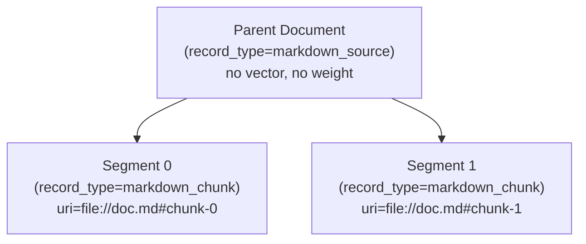
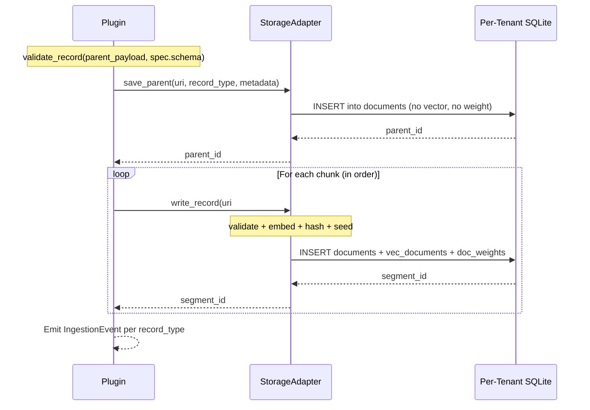
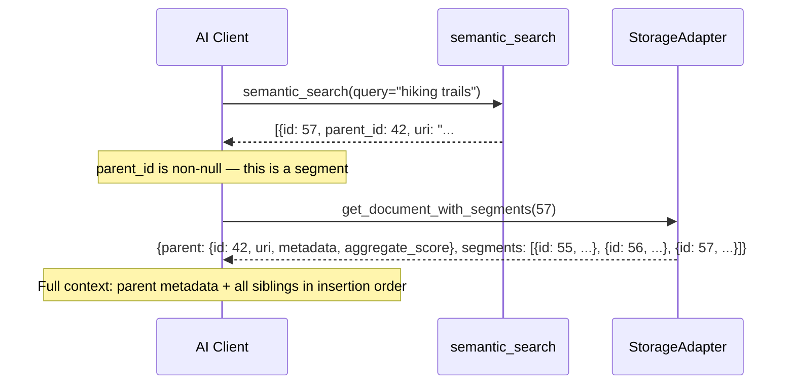

# Plugin Developer Guide

> How to build plugins for Team Mind. This is the starting point for anyone extending the system.

## What You Control

When you build a plugin, you own:

1. **Your record types** — You declare what types of documents your plugin produces (e.g., `user_interest`, `trip_review`, `code_signature`). These are namespaced to your plugin automatically (`your_plugin:your_record_type`), so you'll never collide with other plugins.

2. **Your metadata schema** — The `metadata` JSON column is yours. Store whatever structure you need per document — free-form fields, nested objects, arrays. You declare a **JSON Schema** describing this payload; it is your design, but as of SPEC-012 it is **mandatory and enforced on every write** (see [Record Type Schemas Are Mandatory and Enforced](#record-type-schemas-are-mandatory-and-enforced)).

3. **Your storage mode per document** — For each document you ingest, you choose:
   - **Pointer mode**: Store a URI reference. The content lives externally (file, URL, API) and is fetched live on demand. Best for stable, long-lived sources.
   - **Embedded mode**: Store the full content directly in the `metadata` JSON under a `local_payload` key. Best for ephemeral content, user input, or anything without a stable external URL.
   - You can mix both modes freely within the same record type.

4. **Your MCP tools** — You define what tools AI agents can call and what those tools do. Tools are your plugin's public API.

5. **Your ingestion logic** — You decide which URIs from a bundle are relevant, how to process them, how to chunk/transform content, and what to store.

6. **Your observation reactions** — You decide what to do when other plugins finish ingesting (auditing, notifications, cross-plugin triggers).

## What the Platform Provides

You don't build these — they're shared infrastructure:

- **The `documents` table** — A per-tenant table with columns: `id`, `uri`, `plugin`, `record_type`, `metadata` (JSON). Your plugin writes rows tagged with your plugin name and record type. Other plugins can read your data by querying your record type.
- **The `vec_documents` table** — Vector embeddings linked to document rows. Used for semantic (KNN) search.
- **The `doc_weights` table** — Per-document relevance scores, decay configuration, and tombstone flag. Platform-managed.
- **The `PluginRegistry`** — Handles registration, tool routing, and record type catalog. You register; it routes.
- **The `IngestionPipeline`** — Two-phase pipeline: broadcasts bundles to processors (Phase 1), then notifies observers with structured events (Phase 2). Injects the correct per-tenant `StorageAdapter` into `bundle.storage` before calling your processor.
- **The `TenantStorageManager`** — Manages per-tenant SQLite databases. Plugins never interact with this directly — the pipeline resolves the correct adapter and injects it via `bundle.storage`.
- **Cross-plugin queries** — Any plugin can query by `plugins` and/or `record_types` lists. If your data is useful to others, they can discover it via `list_record_types` and query it via `semantic_search`.

### Tenant Transparency

**Plugins are tenant-unaware by design.** Your `process_bundle` method receives a `bundle` with `bundle.storage` already pointing to the correct per-tenant `StorageAdapter`. You write to `bundle.storage` — the pipeline and `TenantStorageManager` handle all tenant routing.

You will never see `TenantStorageManager` in your plugin code. Tenant routing is a pipeline/manager concern, not a plugin concern.

## Plugin Interfaces

There are three interfaces. Pick any combination depending on what your plugin does:

| Interface | Role | When to use |
|-----------|------|-------------|
| **ToolProvider** | Expose tools to AI clients | You want AI agents to call your plugin's functionality |
| **IngestProcessor** | Do ingestion work (parse, chunk, store) | You want to process raw URIs and write documents to storage |
| **IngestObserver** | React to completed ingestion | You want to know when other plugins have finished ingesting (audit, notify, trigger) |

Common combinations:

| Pattern | Example | Use Case |
|---------|---------|----------|
| ToolProvider only | `DocumentRetrievalPlugin` | Query/action tools, no ingestion |
| IngestProcessor only | *(future)* Metrics collector | Silently processes documents |
| IngestObserver only | *(future)* Audit plugin | Reacts when ingestion completes |
| ToolProvider + IngestProcessor | `MarkdownPlugin` | Ingests AND exposes search tools |
| ToolProvider + IngestObserver | *(future)* Dashboard plugin | Tools AND reacts to ingestion |

### ToolProvider — Expose tools to AI clients

```python
from team_mind_mcp.server import ToolProvider, RecordTypeSpec
from mcp.types import Tool, TextContent

class MyPlugin(ToolProvider):
    @property
    def name(self) -> str:
        return "my_plugin"

    @property
    def record_types(self) -> list[RecordTypeSpec]:
        return [
            RecordTypeSpec(
                name="my_data_type",
                description="What this document type represents.",
                # A JSON Schema describing the metadata payload 1:1. Mandatory
                # and enforced on every write (SPEC-012). Envelope fields
                # (uri, id, plugin, ...) must NOT appear here.
                schema={
                    "type": "object",
                    "properties": {
                        "field_a": {"type": "string", "description": "..."},
                        "field_b": {"type": "integer", "description": "..."},
                    },
                    "required": ["field_a"],
                },
            )
        ]

    def get_tools(self) -> list[Tool]:
        return [
            Tool(
                name="my_tool",
                description="What this tool does.",
                inputSchema={
                    "type": "object",
                    "properties": {
                        "query": {"type": "string"}
                    },
                    "required": ["query"]
                }
            )
        ]

    async def call_tool(self, name: str, arguments: dict) -> list[TextContent]:
        if name == "my_tool":
            # Your logic here
            return [TextContent(type="text", text="result")]
        raise ValueError(f"Unknown tool: {name}")
```

### IngestProcessor — Process incoming documents

Processors receive raw URIs, do the heavy lifting (parsing, chunking, embedding), write to storage, and return `IngestionEvent` objects describing what they wrote.

```python
from team_mind_mcp.server import IngestProcessor, RecordTypeSpec
from team_mind_mcp.ingestion import IngestionBundle, IngestionEvent
from team_mind_mcp.toolkit import write_record

class MyIngestionPlugin(IngestProcessor):
    # No storage injected in constructor — the pipeline injects it via bundle.storage

    @property
    def name(self) -> str:
        return "my_ingestion_plugin"

    @property
    def record_types(self) -> list[RecordTypeSpec]:
        return [
            RecordTypeSpec(
                name="processed_item",
                description="An item extracted during ingestion.",
                schema={
                    "type": "object",
                    "properties": {
                        "summary": {"type": "string"},
                        "local_payload": {"type": "string"},   # embedded-mode content
                    },
                    "required": ["summary"],
                },
                embed_source=["summary"],   # write_record vectorizes this field
            )
        ]

    async def process_bundle(self, bundle: IngestionBundle) -> list[IngestionEvent]:
        doc_ids = []
        processed_uris = []

        # Resolve the record type spec once; write_record needs it. Stamp the
        # plugin so the envelope records the right owner even when this plugin is
        # used un-registered (e.g. a direct process_bundle call in a test).
        spec = next(rt for rt in self.record_types if rt.name == "processed_item")
        spec.plugin = self.name

        for uri in bundle.uris:
            if not self._is_relevant(uri):
                continue

            processed_uris.append(uri)
            content = self._fetch_and_process(uri)

            # Write through the canonical path. write_record validates the payload
            # against the schema, embeds embed_source, hashes, seeds reliability
            # (bundle.reliability_hint -> default -> 0.0), and inserts-or-updates
            # idempotently via the URI's context. No manual embedding or
            # save_payload — those bypass schema validation.

            # Pointer mode: store a reference-sized summary; fetch full content on demand
            doc_id = write_record(
                bundle.storage, "processed_item",
                {"summary": content[:200]},
                uri, bundle.tenant_id,
                spec=spec,
                reliability_hint=bundle.reliability_hint,
                context=bundle.contexts.get(uri),
            )
            doc_ids.append(doc_id)

            # OR Embedded mode: also carry the full content inside the payload
            doc_id = write_record(
                bundle.storage, "processed_item",
                {"summary": content[:200], "local_payload": content},
                uri, bundle.tenant_id,
                spec=spec,
                reliability_hint=bundle.reliability_hint,
                context=bundle.contexts.get(uri),
            )
            doc_ids.append(doc_id)

        # Return events describing what you wrote
        if processed_uris:
            return [IngestionEvent(
                plugin=self.name,
                record_type="processed_item",
                uris=processed_uris,
                doc_ids=doc_ids
            )]
        return []
```

### IngestObserver — React to completed ingestion

Observers don't process raw URIs. They receive structured `IngestionEvent` objects **after** all processors have finished, describing what was written. Use this for auditing, notifications, cross-plugin triggers, or any reaction to "something was just ingested."

```python
from team_mind_mcp.server import IngestObserver
from team_mind_mcp.ingestion import IngestionEvent

class AuditPlugin(IngestObserver):
    @property
    def name(self) -> str:
        return "audit_plugin"

    async def on_ingest_complete(self, events: list[IngestionEvent]) -> None:
        for event in events:
            if event.plugin == "java_plugin" and event.record_type == "code_signature":
                # Java code was updated — trigger compliance audit
                await self._run_audit(event.uris, event.doc_ids)
```

**What's in an IngestionEvent:**
```python
@dataclass
class IngestionEvent:
    plugin: str                 # Which processor wrote the data
    record_type: str            # What record type was written
    uris: list[str]             # Which source URIs were processed
    doc_ids: list[int]          # IDs of the document rows created
    semantic_types: list[str]   # Input semantic types (empty for structured push)
    tenant_id: str              # Which tenant shard was written to (default: "default")
```

### Combining interfaces

```python
# Ingest AND expose tools (like MarkdownPlugin)
class MyFullPlugin(ToolProvider, IngestProcessor):
    # Implement: name, record_types, get_tools, call_tool, process_bundle
    ...

# Tools AND react to ingestion
class MyDashboard(ToolProvider, IngestObserver):
    # Implement: name, get_tools, call_tool, on_ingest_complete
    ...
```

## The Two-Phase Ingestion Pipeline

When documents are ingested, the pipeline runs in two phases:

```
Phase 1 — Processing (parallel):
  Raw URIs → IngestionBundle → broadcast to all IngestProcessors
  → Each processor writes documents, returns IngestionEvents

Phase 2 — Observation (parallel, after Phase 1 completes):
  Collected IngestionEvents → broadcast to all IngestObservers
  → Each observer reacts to what was written
```

**Key guarantee:** Observers never run until all processors have finished. When your observer receives events, the data is committed and queryable.

## Storage: How Your Data Lives in the Database

The `documents` table is shared, but your data is yours:

```
┌──────────────────────────────────────────────────────────────────────┐
│                          documents table                             │
├────┬──────────────────┬───────────────────┬─────────────┬───────────┤
│ id │ uri              │ plugin            │ record_type │ metadata  │
├────┼──────────────────┼───────────────────┼─────────────┼───────────┤
│  1 │ file:///doc.md   │ markdown_plugin   │ md_chunk    │ {chunk…}  │
│  2 │ file:///doc.md   │ markdown_plugin   │ md_chunk    │ {chunk…}  │
│  3 │ user://input     │ travel_plugin     │ interest    │ {local…}  │
│  4 │ https://dest.com │ travel_plugin     │ dest_info   │ {name…}   │
│  5 │ file:///code.py  │ ast_plugin        │ signature   │ {func…}   │
└────┴──────────────────┴───────────────────┴─────────────┴───────────┘

 Your plugin's rows are scoped by the `plugin` and `record_type` columns.
 Other plugins can query your data by record_type, but you own it.
```

**Key points:**
- The `plugin` column is always set to your plugin's `name` property. This is automatic ownership.
- The `record_type` column is whatever you declared in your `record_types` property. One plugin can have multiple record types.
- The `metadata` column is a JSON blob — you define its shape. Your record type's `schema` is a JSON Schema that both tells others what to expect **and is enforced on every write** (SPEC-012): a payload that fails it is rejected and nothing is stored. The `metadata` you store is exactly the validated payload, 1:1.
- The `uri` column identifies the source. For embedded content, it can be any identifier you choose (e.g., `user://preferences/hiking`).

## Querying Data (Yours or Other Plugins')

```python
# Query your own data
results = storage.retrieve_by_vector_similarity(
    vector, limit=10,
    plugins=["my_plugin"],
    record_types=["my_data_type"]
)

# Query another plugin's data (cross-plugin)
results = storage.retrieve_by_vector_similarity(
    vector, limit=10,
    plugins=["travel_plugin"],
    record_types=["interest", "dest_info"]
)

# Query across all plugins (no filters)
results = storage.retrieve_by_vector_similarity(vector, limit=10)
```

All filter parameters accept **lists**, so you can query multiple plugins and record types in a single call.

### Metadata Filters

The `metadata` JSON column is queryable at search time through optional equality filters:

```python
results = storage.retrieve_by_vector_similarity(
    vector, limit=10,
    metadata_filters={"interest_category": "sports", "league": "nfl"}
)
# → WHERE json_extract(metadata, '$.interest_category') = 'sports'
#     AND json_extract(metadata, '$.league') = 'nfl'
```

Metadata filters compose with `plugins` and `record_types` filters. All filter keys must match `^[A-Za-z0-9_]+$` (alphanumeric and underscores only).

**Optional vector query:** When the caller omits `target_vector`, the storage layer queries the `documents` table directly without a KNN join and ranks results by composite weight score (`usage_score * decay`) descending. All metadata, plugin, and record_type filters still apply.

### Structural Fields vs. Metadata Fields

This distinction determines what you should put in first-class columns vs. what goes in the `metadata` JSON:

| | First-class columns | Metadata fields |
|---|---|---|
| **Purpose** | Framework routing, identity, system behavior | Domain-specific attributes for query-time filtering |
| **Who controls** | Framework / pipeline | Your plugin |
| **Examples** | `plugin`, `record_type`, `semantic_type`, `media_type` | `interest_category`, `league`, `destination`, `price_range` |
| **How to filter** | Dedicated WHERE clause (fast, indexed) | `json_extract` (per-query) |

**The rule:** If the framework/pipeline needs it to make routing or identity decisions, it's a column. If only your plugin's consumers need it at query time for filtering, it belongs in `metadata`.

## Understanding the Three-Type Model

SPEC-008 (ADR-007) introduces three distinct type concepts. If you're building a processor, you need to understand all three:

| Type | What it answers | Set by | Example |
|------|----------------|--------|---------|
| **Semantic type** | "What does this data *mean*?" | Ingestion caller | `architecture_docs`, `payment_service` |
| **Media type** | "How is this data *encoded*?" | Plugin (auto-detected) | `text/markdown`, `text/x-java` |
| **Record type** | "What did the plugin *produce*?" | Plugin, at write time | `markdown_chunk`, `code_signature` |

Previously called `doctype`, record type is the plugin-scoped output concept. Semantic type and media type are new columns on `documents` added in SPEC-008.

Keep these distinct when you author record types. **`record_type` is not `semantic_type`.** A `semantic_type` labels what raw *input* means and can fan out to many record types (`meeting` → `meeting_metrics` + `architecture_strawman`). A `record_type` is what your plugin *produced*. The structured-push path below routes purely by `record_type` — the caller has already refined the input, so there is no input-semantic fan-out to resolve.

## Record Type Schemas Are Mandatory and Enforced

As of SPEC-012 (ADR-011), a record type's `schema` is no longer advisory. Two rules now hold for **every** record type you declare — submittable or not:

1. **The schema is mandatory.** It must be a **non-empty JSON Schema** (`{"type": "object", "properties": {...}}`). Registration rejects a plugin whose record type has a missing or empty schema.
2. **It is enforced on every write.** Every write goes through the canonical `write_record` path (below), which validates the payload against the schema and **rejects it — writing nothing — on failure**. This holds for external pushes *and* for a plugin writing its own refined output.

The schema describes the **`metadata` sub-document (the payload) 1:1** — nothing else. Envelope fields live on the containing record and **must not** appear as schema properties:

```python
# Envelope fields (framework-owned, on the record — NOT in your payload schema):
#   id, uri, plugin, content_hash, vector, tenant
#   (also record_type, plugin_version, semantic_type, media_type, parent_id)
```

For `submittable` record types the registration guard actively rejects a schema that declares any of `{id, uri, plugin, content_hash, vector, tenant}` as a property, and rejects a second plugin declaring the same submittable record type (one declarer per submittable `record_type`).

**Payload field naming:** use `snake_case`, 1:1 with the stored key (no aliasing), and never flatten — the payload stays nested under `metadata`. Because storage and queries are by name, **renaming a payload field is storage-breaking** (it orphans existing rows and stored queries); adding a field is safe.

## The Canonical Write Path: `write_record`

All record writes go through one toolkit method, `team_mind_mcp.toolkit.write_record`. The framework uses it on the structured-push path, and your plugin should use it on the raw path so your writes are validated like everything else. It owns validation, embedding, hashing, reliability seeding, and idempotency in one place:

```python
from team_mind_mcp.toolkit import write_record, RecordValidationError

# spec is the RecordTypeSpec for this record_type (yours, or resolved by the framework)
try:
    doc_id = write_record(
        bundle.storage,                 # the per-tenant StorageAdapter
        "processed_item",               # record_type (routing / ownership key)
        {"content": "..."},             # payload — stored 1:1 as metadata
        uri,                            # identity key (idempotency / updates)
        bundle.tenant_id,
        spec=spec,                      # keyword-only from here on
        reliability_hint=bundle.reliability_hint,  # top rung of the SPEC-007 ladder
        context=bundle.contexts.get(uri),          # insert vs. update-in-place
        parent_id=parent_id,            # optional — link a segment to its parent
        semantic_type=",".join(bundle.semantic_types),  # envelope fields, raw path only
        media_type=media_type,
        plugin_version=self.version,
    )
except RecordValidationError as exc:
    # Payload failed the record type's JSON Schema — nothing was written.
    # exc.errors is a list of structured "<path>: <message>" strings.
    ...
```

What `write_record` does, in order: **(1) validate** the payload against `spec.schema` (reject on failure, write nothing); **(2) embed** the text at `spec.embed_source` if declared, else store no vector; **(3) content_hash** the payload; **(4) seed reliability** via the SPEC-007 ladder (`reliability_hint` → `spec.default_reliability` → `0.0`); **(5) idempotency** — insert a new row or update the existing one in place (preserving its `doc_id` and weight) based on `context`; **(6) store** the payload 1:1 as `metadata`. It returns the `doc_id`.

> Parents are the one exception: a SPEC-011 parent (via `save_parent`) has no vector and no weight row, so it is not written through `write_record`. Validate the parent payload explicitly with `validate_record(payload, spec.schema)` (as MarkdownPlugin does), then call `save_parent`. Segments go through `write_record` as normal.

## Declaring an Embed Source

A record type declares which payload field(s) to vectorize via `embed_source`, a list of dotted field paths. `write_record` concatenates the text at those paths and embeds it:

```python
RecordTypeSpec(
    name="markdown_chunk",
    description="A paragraph-level chunk extracted from a markdown document.",
    schema={
        "type": "object",
        "properties": {"chunk": {"type": "string"}},
        "required": ["chunk"],
    },
    embed_source=["chunk"],          # vectorize payload["chunk"]; record is vector-searchable
)
```

- `embed_source` set → the record gets a vector and is findable via `semantic_search`.
- `embed_source` omitted (`None`) → no vector; the record is metadata-only, still findable via SPEC-010 metadata search.

## Authoring a Submittable Record Type (Structured Push)

`submittable` opens a record type to **external push** via the `submit_structured` MCP tool — a caller (an AI agent in its own harness, or a deterministic tool) that has *already refined* a record hands you the finished instance, and the framework validates and writes it. This is a **separate axis from validation**: `submittable=True` only controls external-push exposure; it does *not* change whether validation happens (every record type is validated regardless).

Declare one on a `ToolProvider` or `IngestProcessor` plugin:

```python
RecordTypeSpec(
    name="service_profile",
    description="A refined profile of a service, pushed by an external agent.",
    schema={                              # MANDATORY — describes the metadata payload only
        "type": "object",
        "properties": {
            "service_name": {"type": "string"},
            "language":     {"type": "string"},
            "summary":      {"type": "string"},
        },
        "required": ["service_name"],
    },
    submittable=True,                     # exposes it to submit_structured
    embed_source=["summary"],             # optional — vectorize the summary
    default_reliability=0.8,              # optional — middle rung of the SPEC-007 ladder
)
```

Registration enforces: a non-empty schema, **no envelope fields** in the schema, and a **single submittable declarer** for the name. There is **no `semantic_types` field** on `RecordTypeSpec` — pushed routing is by `record_type` alone.

### What `submit_structured` accepts

```json
{
  "tool": "submit_structured",
  "arguments": {
    "records": [
      {
        "record_type": "service_profile",
        "payload": {"service_name": "billing", "language": "python", "summary": "..."},
        "uri": "service://billing",
        "reliability_hint": 0.9
      }
    ],
    "tenant_id": "default"
  }
}
```

- **Batch, matching `ingest_documents`.** Each record `{record_type, payload, uri, reliability_hint?}` is validated and written **independently**. A single record is a one-element list.
- **`payload`** is validated against the record type's schema and stored 1:1 as `metadata`. **`uri`** is the identity key for idempotency and updates. **`reliability_hint`** is optional (top of the SPEC-007 ladder).
- **Strict per record, best-effort across the batch.** An invalid or not-submittable record returns its errors and writes nothing; valid siblings still land. There is no all-or-nothing rollback.
- **An empty `records` list is an error** (at least one record required).

The response is a per-record result list — `{"uri", "record_type", "status": "written", "doc_id"}` on success, or `{..., "status": "error", "errors": [...]}` on rejection.

### Observers fire on pushed records too

A successful push emits an `IngestionEvent(record_type=…, doc_ids=[…], semantic_types=[])` and runs the same Phase-2 observer broadcast as the raw path. Observers subscribed by `record_type` (or plugin) fire normally. **Pushed events carry `semantic_types=[]`** — a pushed record has no input `semantic_type` — so subscribe by `record_type` if you want to react to pushes.

## Raw Content by Value (Inline `ingest_documents`)

`ingest_documents` accepts documents **by value** as well as by reference. Alongside `uris` (fetched by reference), you may pass a `documents` array whose items carry inline content:

```json
{
  "tool": "ingest_documents",
  "arguments": {
    "documents": [
      {
        "uri": "mem://note/42",
        "content": "# Inline markdown\n\nSupplied directly, not fetched.",
        "media_type": "text/markdown"
      }
    ],
    "semantic_types": ["architecture_docs"]
  }
}
```

- When `content` is present the pipeline uses it directly — **no fetch** — and `media_type` is **required** (an inline URI has no extension to infer from). The `uri` is still the identity key.
- Omit `content` and the item is fetched by reference as before.
- Inline content is threaded to your processor via `bundle.contents[uri]` (and the declared media type via `bundle.declared_media_types[uri]`). **Decoding stays in your plugin** — there is no framework decoder or intermediate representation; use standard Python libraries.

```python
async def process_bundle(self, bundle):
    for uri in bundle.uris:
        if uri in bundle.contents:
            content = bundle.contents[uri]        # supplied inline — no fetch
        else:
            content = self._fetch(uri)            # by reference
        media_type = bundle.declared_media_types.get(uri) or get_media_type(uri)
        ...
```

## Available vs Enabled: Activation Model

Registered plugins exist in one of two states:

| State | Registered? | Has semantic types? | Processes content? |
|-------|------------|--------------------|--------------------|
| **Available** | Yes | No | No — idle |
| **Enabled** | Yes | Yes (specific types or `*`) | Yes, for matching types |

**Key rule: no semantic types = no processing.** A registered plugin with no semantic type associations is available but idle. This is intentional — newly installed plugins don't automatically process all content. An admin must explicitly enable processing for specific semantic types.

`["*"]` is a wildcard that opts the plugin into processing all semantic types (respecting media type filtering). It must be explicitly configured — it is not the default.

## Declaring Your Media Type Capabilities

Processors declare which media types they can handle:

```python
class MyPlugin(IngestProcessor):
    @property
    def supported_media_types(self) -> list[str]:
        return ["text/markdown", "text/plain"]
```

Even in wildcard mode, your plugin only receives URIs matching these media types. Media type is auto-detected from file extension or can be explicitly hinted by the ingestion caller.

## Registering Your Plugin

There are two ways to register plugins:

### Compile-time registration (core plugins)

Core plugins are registered in `cli.py` at server startup. You can optionally provide `semantic_types` to enable the plugin immediately:

```python
# Available but idle (no semantic types):
gateway.registry.register(markdown_plugin)

# Available and enabled for specific semantic types:
gateway.registry.register(markdown_plugin, semantic_types=["architecture_docs", "meeting_transcripts"])
```

### Runtime registration (dynamic plugins)

Plugins can be registered at runtime via the `register_plugin` MCP tool — no server restart needed:

```python
# Register and enable for specific semantic types:
register_plugin(
    module_path="my_plugins.travel.TravelPlugin",
    semantic_types=["travel_profile", "booking_data"]
)

# Register as available-only (no ingestion routing yet):
register_plugin(module_path="my_plugins.travel.TravelPlugin")
```

Dynamically registered plugins:
- Are persisted to the `registered_plugins` table — they survive restarts
- Can be unregistered via `unregister_plugin(plugin_name)`
- Can be listed via `list_plugins()`

### What happens on registration:
- Your tools are added to the MCP tool catalog (visible to AI clients).
- Your record types are added to the record type catalog (discoverable via `list_record_types`).
- If you implement `IngestProcessor` **and** have semantic types configured, you receive bundles for those types during ingestion.
- If you implement `IngestObserver`, you start receiving events after ingestion completes.

### Event subscriptions for observers

By default, observers receive **all** ingestion events (fire hose). To subscribe to specific events only, override the `event_filter` property. SPEC-008 adds `semantic_types` filtering so observers can react to domain-level events:

```python
from team_mind_mcp.server import IngestObserver, EventFilter

class AuditPlugin(IngestObserver):
    @property
    def event_filter(self) -> EventFilter | None:
        # Only care about architecture docs, regardless of which plugin processed them
        return EventFilter(
            semantic_types=["architecture_docs"]
        )

    async def on_ingest_complete(self, events):
        # Receives events where any semantic_type matches "architecture_docs"
        for event in events:
            await self._run_audit(event.uris)
```

| Pattern | event_filter returns | What the observer receives |
|---------|---------------------|--------------------------|
| Fire hose | `None` (default) | Every event from every processor |
| Semantic type filter | `EventFilter(semantic_types=["architecture_docs"])` | Events where any semantic type matches |
| Plugin filter | `EventFilter(plugins=["java_plugin"])` | Only events from that plugin |
| Record type filter | `EventFilter(record_types=["code_signature"])` | Only events with that record type |
| Combined | `EventFilter(plugins=[...], record_types=[...], semantic_types=[...])` | Events matching all specified filters |

Semantic type filtering uses ANY-match semantics: an event passes if any of its `semantic_types` values appears in the filter's `semantic_types` list.

## Reliability Seeding

When a document is first saved, its `usage_score` in `doc_weights` is seeded to a caller-supplied or plugin-declared quality value. This is the **three-layer reliability model** introduced in SPEC-007.

### The Three Layers (highest priority wins)

| Layer | Source | How |
|-------|--------|-----|
| **1. Ingest hint** | Ingestion caller | `reliability_hint` parameter on `ingest_documents` MCP tool or `ingest --reliability` CLI flag |
| **2. Plugin default** | `RecordTypeSpec.default_reliability` | Declared on the record type at plugin definition time |
| **3. Platform default** | `0.0` | Used when neither of the above is provided |

You do not resolve these layers yourself — **the canonical `write_record` resolves the ladder** (`reliability_hint` → `spec.default_reliability` → `0.0`) and seeds `usage_score`. Declare `default_reliability` on the record type (Layer 2) and pass the caller's `bundle.reliability_hint` (Layer 1) through to `write_record`.

### How to implement it in your plugin

```python
from team_mind_mcp.server import IngestProcessor, RecordTypeSpec
from team_mind_mcp.ingestion import IngestionBundle
from team_mind_mcp.toolkit import write_record

class MyPlugin(IngestProcessor):
    @property
    def record_types(self) -> list[RecordTypeSpec]:
        return [
            RecordTypeSpec(
                name="my_record_type",
                description="A record produced by my plugin.",
                schema={
                    "type": "object",
                    "properties": {"content": {"type": "string"}},
                    "required": ["content"],
                },
                embed_source=["content"],
                default_reliability=0.7,  # Layer 2: plugin-declared default
            )
        ]

    async def process_bundle(self, bundle: IngestionBundle) -> list[IngestionEvent]:
        spec = next(rt for rt in self.record_types if rt.name == "my_record_type")
        spec.plugin = self.name

        for uri in bundle.uris:
            content = self._fetch_and_process(uri)

            # write_record applies the ladder: bundle.reliability_hint (Layer 1)
            # -> spec.default_reliability (Layer 2) -> 0.0 (Layer 3), seeding
            # usage_score. No manual resolution, no initial_score plumbing.
            doc_id = write_record(
                bundle.storage, "my_record_type",
                {"content": content},
                uri, bundle.tenant_id,
                spec=spec,
                reliability_hint=bundle.reliability_hint,
                context=bundle.contexts.get(uri),
            )
```

> Under the hood `write_record` passes the resolved value as `initial_score` to `save_payload` — the mechanism below is unchanged, you just no longer wire it by hand.

### What `initial_score` does

`initial_score` seeds `usage_score` in the `doc_weights` table when the document is first created. The `signal_count` remains `0`, so the first real feedback signal will average in normally. Documents with a higher initial score rank higher in search results immediately after ingestion — before any feedback arrives.

- `initial_score=0.0` (default) — no bias; ranking is purely by vector distance.
- `initial_score=0.8` — document gets a moderate quality head start in rankings.
- `initial_score=1.0` — maximum initial boost.

### Caller-side usage

**Via MCP tool:**
```json
{
  "tool": "ingest_documents",
  "arguments": {
    "uris": ["file:///path/to/doc.md"],
    "semantic_types": ["architecture_docs"],
    "reliability_hint": 0.9
  }
}
```

**Via CLI:**
```bash
uv run team-mind ingest --reliability 0.9 /path/to/doc.md
```

## Integration Options Summary

Team Mind plugins support a wide array of integration patterns:

| Capability | Options |
|-----------|---------|
| **Interfaces** | `ToolProvider`, `IngestProcessor`, `IngestObserver` — any combination |
| **Registration** | Compile-time (hardcoded in cli.py) or runtime (via `register_plugin` MCP tool) |
| **Activation** | Available (no semantic types = idle) or enabled (specific types or `["*"]` wildcard) |
| **Routing** | Semantic type routing — processors receive only URIs for their registered semantic types |
| **Media type filtering** | Declare `supported_media_types`; only matching URIs are routed to your plugin |
| **Observation mode** | Fire hose (all events) or topic-based (filtered by plugin/record_type/semantic_type) |
| **Storage mode** | Pointer (URI reference) or embedded (`local_payload` in metadata) |
| **Idempotent ingestion** | Content hashing, plugin versioning, `IngestionContext` per URI |
| **Relevance weighting** | Decay policy per record type, feedback signals, tombstoning |
| **Reliability seeding** | Three-layer initial score (ingest hint > plugin default > 0.0), resolved inside `write_record` |
| **Document updates** | In-place or wipe-and-replace, both through `write_record` (insert vs. update chosen from context) |

## Relevance Weighting (Platform-Managed)

The platform automatically manages relevance weighting for all plugins. You don't implement scoring — the platform does it for you. Your documents gain or lose value based on AI/human feedback and time-based decay.

### What you get for free

- **Usage-based ranking**: When an AI agent or human calls `provide_feedback(doc_id, signal)`, the platform updates the document's score. Higher-scored documents rank higher in search results.
- **Composite scoring**: Search results are ranked by `final_rank = vector_distance - (usage_score * weight_influence * decay_factor)`, not just vector distance alone.
- **Tombstoning**: Bad documents can be flagged out of all search results without being deleted.

### What you control: Decay policy

Declare `decay_half_life_days` on your `RecordTypeSpec` to control how fast your data's boost decays over time:

```python
RecordTypeSpec(
    name="meeting_notes",
    description="Notes from team meetings.",
    decay_half_life_days=30,     # Loses half its boost every 30 days
)

RecordTypeSpec(
    name="code_signature",
    description="Function signatures from source code.",
    decay_half_life_days=None,   # No decay — code doesn't age
)
```

- `None` (default) = no decay. Usage score stays at full value forever.
- A number = half-life in days. After that many days, the effective score is halved.

### How scoring works

| What | Who does it | How |
|------|-------------|-----|
| Feedback signals | AI agents / humans via `provide_feedback` MCP tool | `signal` from -5 (strongly demote) to +5 (strongly promote) |
| Score accumulation | Platform | Signals are **averaged**: each new signal is folded into the running average proportionally |
| Decay | Platform, at query time | `effective_score = usage_score * 0.5^(days_old / half_life)` |
| Tombstone | AI agents / humans via `provide_feedback(tombstone=true)` | Document excluded from all search results, reversible |

### What if you don't care about weighting?

Don't set `decay_half_life_days`. Don't call `provide_feedback`. Your documents get `usage_score=0.0`, `decay_factor=1.0`, and results are ranked by **pure vector distance** — identical to a system with no weighting at all.

### The `doc_weights` table

Each document gets one row in `doc_weights` (auto-created when the document is saved):

```
doc_weights
├── doc_id          → FK to documents
├── usage_score     → Running average of feedback signals (starts at 0.0)
├── signal_count    → Number of signals received (for averaging math)
├── created_at      → When the doc was ingested
├── last_accessed   → Last feedback timestamp
├── tombstoned      → 0 or 1
└── decay_half_life_days → Copied from RecordTypeSpec (nullable)
```

There is **one row per document**, not one row per feedback event. The running average is maintained via `signal_count` — no compaction or aggregation needed at scale.

### Idempotent ingestion (content hashing & plugin versioning)

When the pipeline broadcasts a bundle, it provides an `IngestionContext` for each URI in `bundle.contexts[uri]`. This tells your processor whether the URI has been ingested before, whether the content changed, and whether your plugin version has changed:

```python
from team_mind_mcp.toolkit import write_record

async def process_bundle(self, bundle: IngestionBundle) -> list[IngestionEvent]:
    spec = next(rt for rt in self.record_types if rt.name == "my_type")
    spec.plugin = self.name

    for uri in bundle.uris:
        ctx = bundle.contexts.get(uri)
        content = self._fetch(uri)

        if ctx and ctx.is_update:
            # The skip/wipe DECISION is yours. If your plugin version changed,
            # re-process; otherwise let write_record's context handle the update.
            if not ctx.plugin_version_changed and not self._content_changed(uri, content):
                continue  # Nothing changed — skip re-embedding

            # Structure may change (paragraph count differs) — wipe, then re-insert fresh.
            bundle.storage.delete_by_uri(uri, plugin=self.name, record_type="my_type")

        # The WRITE goes through write_record: it validates the payload, embeds,
        # content-hashes, seeds reliability, and stores — never a raw save_payload.
        # Pass context for automatic insert-vs-update-in-place on stable-identity
        # records; omit it (as here) after a wipe, so it inserts fresh.
        doc_id = write_record(
            bundle.storage, "my_type",
            {"content": content},
            uri, bundle.tenant_id,
            spec=spec,
            reliability_hint=bundle.reliability_hint,
            context=None,   # fresh insert after a wipe; pass ctx for in-place update
            plugin_version=self.version,
        )
```

> **On change detection:** `write_record` computes and stores its own hash *over the payload* and, when you pass `context=bundle.contexts.get(uri)`, updates the record in place instead of inserting. The context's `previous_content_hash` therefore reflects that payload hash — so an early "skip if unchanged" optimization is the plugin's own concern: keep a fingerprint of the raw source (as MarkdownPlugin does on its parent row via `save_parent(content_hash=...)`) and compare it before re-embedding. For records with a stable shape, the simplest correct approach is to skip the manual hashing entirely and just pass `context` so `write_record` updates in place; use the wipe-and-replace path above only when the number of segments can change.

**Plugin decision matrix:**

| is_update | content_changed | version_changed | Typical action |
|-----------|----------------|-----------------|----------------|
| false | N/A | N/A | Fresh insert |
| true | false | false | Skip (nothing changed) |
| true | true | false | Wipe and replace |
| true | false | true | Re-process (plugin logic changed) |
| true | true | true | Wipe and replace |

**Declaring your plugin version:**

```python
class MyPlugin(IngestProcessor):
    @property
    def version(self) -> str:
        return "1.0.0"  # Bump when your processing logic changes
```

Default is `"0.0.0"`. The platform stores this with every document so future versions of your plugin can detect docs processed by older logic.

### Updating and replacing documents

Both patterns for keeping data current go through `write_record` — it validates every write and chooses insert vs. update-in-place from the URI's context:

**Update a record in place** (preserves its weight) — pass the `context`; when the record already exists `write_record` updates it in place, preserving `doc_id`, `uri`, `plugin`, `record_type`, and `usage_score`:
```python
doc_id = write_record(
    bundle.storage, "my_type",
    {"chunk": "updated content", "version": 2},
    uri, bundle.tenant_id,
    spec=spec,
    context=bundle.contexts.get(uri),   # existing doc → update in place
)
```

**Wipe and re-ingest a whole document** (fresh start) — when the segment structure changes (paragraphs added/removed), delete first, then write fresh (no context, so each write inserts):
```python
# Delete all old chunks for this URI, then re-ingest
deleted = bundle.storage.delete_by_uri(
    uri="file:///doc.md",
    plugin=self.name,
    record_type="markdown_chunk",
)
# Now insert new chunks — they start with usage_score=0.0
for chunk in new_chunks:
    write_record(
        bundle.storage, "markdown_chunk",
        {"chunk": chunk},
        f"file:///doc.md#chunk-{chunk.index}", bundle.tenant_id,
        spec=chunk_spec,
    )
```

`delete_by_uri` is scoped to your plugin and record type — it won't touch another plugin's data for the same URI. Deletion removes the document, vector, and weight rows together.

**Which to use:** If your records have stable identities (e.g., a user preference by ID), pass `context` and let `write_record` update in place. If the document's structure changes on update (paragraphs added/removed), use wipe-and-replace.

> **Prefer `write_record`.** The lower-level `save_payload` / `update_payload` on `StorageAdapter` bypass schema validation, embedding, hashing, and reliability seeding — they are `write_record`'s internals, reserved for framework-internal use and the parent-container case below. Plugin record writes should always go through `write_record`.

### Score averaging (not additive)

Scores use a **cumulative moving average**, not simple addition. Each new signal is averaged into the existing score proportionally:

```
new_count = old_count + 1
new_score = old_score + (signal - old_score) / new_count
```

This means:
- After 100 signals of +5, the average is 5.0
- One person comes along and gives -5 → average becomes ≈ 4.9 (barely moves)
- The score naturally stays bounded to [-5, +5] (the signal range) with no artificial clamping
- Every signal gets proportional weight — early signals and late signals are treated fairly

The `doc_weights` table tracks `signal_count` alongside `usage_score` to maintain the running average.

### URIs for embedded content

When storing content in embedded mode (`local_payload`), the URI is just a **string identifier** — it doesn't need to point to a real file or URL. Use any scheme that makes sense for your data:

```python
# These are all valid URIs for embedded content:
"user://preferences/hiking"
"chat://session-123/msg-5"
"virtual://generated-summary-42"
"api://weather/2026-03-25"
```

The URI serves as a logical identifier for `delete_by_uri` and `get_full_document` lookups regardless of storage mode.

### Chunks are a plugin concept, not a core concept

The platform has no concept of "chunks." Every row in the `documents` table is just a document — the platform doesn't know or care whether a row represents a whole file, a paragraph, a sentence, or a function signature. If your plugin splits a source file into 10 chunks, that's 10 document rows. If another plugin stores one row per file, that's fine too. The platform treats all rows identically.

## Working with Segments (SPEC-011)

SPEC-011 (ADR-009) formalizes the **parent-child relationship** for plugins that split a logical document into multiple independently-weighted rows. This pattern is called **document segmentation**.

### When to use segments

Use segments when your plugin splits a single logical source (a file, a user profile, an API response) into multiple independently-searchable and independently-ratable rows. Examples:

- A markdown file split into paragraph-level chunks
- A user's travel preferences stored as individual interest atoms
- A code file parsed into per-function signature rows

If your plugin stores one row per source, you don't need segments — standalone documents (`parent_id = NULL`) are unchanged.

### Parent-child hierarchy


```mermaid
graph TD
    P["Parent Document\n(record_type=markdown_source)\nno vector, no weight"]
    C1["Segment 0\n(record_type=markdown_chunk)\nuri=file://doc.md#chunk-0"]
    C2["Segment 1\n(record_type=markdown_chunk)\nuri=file://doc.md#chunk-1"]
    P --> C1
    P --> C2
```

- **Parent document**: Has a URI, record type, and metadata. No vector embedding — it is not searchable in KNN. No `doc_weights` row — its score is derived from its children's aggregate.
- **Segments (children)**: Each has its own URI, vector embedding, and weight. These are the units of retrieval and rating. `parent_id` links them back to the parent.

### Ingestion flow with segments


```mermaid
sequenceDiagram
    participant Plugin
    participant Storage as StorageAdapter
    participant DB as Per-Tenant SQLite

    Note over Plugin: validate_record(parent_payload, spec.schema)
    Plugin->>Storage: save_parent(uri, record_type, metadata)
    Storage->>DB: INSERT into documents (no vector, no weight)
    DB-->>Storage: parent_id
    Storage-->>Plugin: parent_id

    loop For each chunk (in order)
        Plugin->>Storage: write_record(uri#chunk-N, payload, spec, parent_id=...)
        Note over Storage: validate + embed + hash + seed
        Storage->>DB: INSERT documents + vec_documents + doc_weights
        DB-->>Storage: segment_id
        Storage-->>Plugin: segment_id
    end

    Plugin-->>Plugin: Emit IngestionEvent per record_type
```

### Creating parents and segments

```python
from team_mind_mcp.toolkit import validate_record, write_record, RecordValidationError

source_spec = next(rt for rt in self.record_types if rt.name == "document_source")
chunk_spec = next(rt for rt in self.record_types if rt.name == "document_chunk")
chunk_spec.plugin = self.name

# PARENT — the deliberate exception. A parent has no vector and no weight row,
# so it is NOT written through write_record (which always creates a weight row).
# Validate the payload against the schema yourself, then call save_parent.
parent_payload = {"source_uri": uri, "chunk_count": len(chunks)}
errors = validate_record(parent_payload, source_spec.schema)
if errors:
    raise RecordValidationError("document_source", errors)
parent_id = storage.save_parent(
    uri=uri,
    plugin=self.name,
    record_type="document_source",
    metadata=parent_payload,
    content_hash=content_hash,
    plugin_version=self.version,
)

# SEGMENTS — normal records: go through write_record (validate + embed via
# embed_source + hash + reliability + weight row). No raw save_payload.
for i, chunk in enumerate(chunks):
    write_record(
        storage, "document_chunk",
        {"chunk": chunk},
        f"{uri}#chunk-{i}", tenant_id,
        spec=chunk_spec,               # declares embed_source=["chunk"]
        parent_id=parent_id,           # links segment to parent
        reliability_hint=bundle.reliability_hint,
    )
```

`save_parent` creates a document row with no vector and no weight entry. It returns the `doc_id` for segments to reference via `parent_id`. **The parent is the one case that legitimately skips `write_record`** — it has no vector or weight to write — but its payload is still schema-validated via `validate_record` first, so no path stores an unvalidated payload. Every other write goes through `write_record`.

### Wipe-and-replace with segments

When re-ingesting an existing source, delete by the parent's URI — the platform cascades the deletion to all child segments:

```python
# Target the parent — cascade delete handles children
storage.delete_by_uri(uri, plugin=self.name, record_type="document_source")
```

After deletion, re-ingest as normal: create a new parent, then new segments.

### Backward compatibility

`parent_id` defaults to `NULL`. Plugins that do not use segments are completely unaffected — their rows are standalone documents and all existing query behavior is unchanged. Segments are opt-in.

### Segment navigation

Search results include a `parent_id` field. When `parent_id` is non-null, the client knows the result is a segment and can call `get_document_with_segments(doc_id)` to retrieve the parent's metadata and all sibling segments for broader context.


```mermaid
sequenceDiagram
    participant Client as AI Client
    participant Search as semantic_search
    participant Storage as StorageAdapter

    Client->>Search: semantic_search(query="hiking trails")
    Search-->>Client: [{id: 57, parent_id: 42, uri: "...#chunk-2", ...}]

    Note over Client: parent_id is non-null — this is a segment

    Client->>Storage: get_document_with_segments(57)
    Storage-->>Client: {parent: {id: 42, uri, metadata, aggregate_score}, segments: [{id: 55, ...}, {id: 56, ...}, {id: 57, ...}]}

    Note over Client: Full context: parent metadata + all siblings in insertion order
```

### Segment ordering

`get_document_with_segments` returns segments in **insertion order** — the order you called `write_record` for each segment is the order they are returned.

**Mechanism:** Each segment row gets an `INTEGER PRIMARY KEY AUTOINCREMENT` id. `get_document_with_segments` queries with `ORDER BY id`, which maps directly to insertion sequence. Because each `write_record` completes its underlying `save_payload` INSERT before the next begins, ids increase monotonically and preserve call order.

**Contrast with retrieval methods:** `retrieve_by_vector_similarity` and `retrieve_by_weight` return segments ranked by relevance or weight score — not by their positional order within the parent. Use `get_document_with_segments` when positional order matters (e.g., reconstructing a document from ordered paragraph chunks).

## Discovery: How Others Find Your Data

AI clients can call the `list_record_types` MCP tool to discover what's available:

```json
// list_record_types(plugins=["travel_plugin"])
[
  {
    "plugin": "travel_plugin",
    "name": "interest",
    "description": "A user's stated travel interest or preference.",
    "schema": {
      "type": "object",
      "properties": {"category": {"type": "string"}, "sentiment": {"type": "string"}},
      "required": ["category"]
    },
    "submittable": false
  },
  {
    "plugin": "travel_plugin",
    "name": "dest_info",
    "description": "Information about a travel destination.",
    "schema": {
      "type": "object",
      "properties": {"name": {"type": "string"}, "region": {"type": "string"}},
      "required": ["name"]
    },
    "submittable": true
  }
]
```

This makes the knowledge base self-describing. An AI agent can ask "what data exists?" and adapt its queries. Each entry carries its full JSON Schema and a `submittable` flag — a caller reads the schema of a `submittable` record type to know exactly what payload `submit_structured` will accept (see [Authoring a Submittable Record Type](#authoring-a-submittable-record-type-structured-push)).

## Reference

| Document | What it covers |
|----------|---------------|
| [ADR-002: Plugin Architecture](ADRs/ADR-002-plugin-architecture.md) | Three interfaces, two-phase pipeline, dual-mode storage, design rationale |
| [ADR-001: Plugin-Scoped Record Types](ADRs/ADR-001-plugin-scoped-record-types.md) | Record type namespacing, cross-plugin queries, schema contracts |
| [SPEC-001: Core Engine](../../specs/SPEC-001-core-engine/design.md) | MCP gateway, storage adapter, ingestion pipeline internals |
| [SPEC-002: Plugin Data Schema](../../specs/SPEC-002-plugin-data-schema/design.md) | RecordTypeSpec model, scoped queries, discovery tool |
| [SPEC-003: Ingestion Interface Split](../../specs/SPEC-003-ingestion-interface-split/design.md) | IngestProcessor/IngestObserver split, IngestionEvent, two-phase pipeline |
| [ADR-003: Relevance Weighting](ADRs/ADR-003-relevance-weighting.md) | Scoring model, decay policy, tombstoning, signal design |
| [SPEC-004: Relevance Weighting](../../specs/SPEC-004-relevance-weighting/design.md) | doc_weights table, feedback tool, composite scoring, spike results |
| [ADR-004: Idempotent Ingestion](ADRs/ADR-004-idempotent-ingestion.md) | Content hashing, plugin versioning, IngestionContext, decision matrix |
| [SPEC-005: Idempotent Ingestion](../../specs/SPEC-005-idempotent-ingestion/design.md) | Schema changes, pipeline integration, MarkdownPlugin optimization |
| [ADR-005: Plugin Lifecycle](ADRs/ADR-005-plugin-lifecycle.md) | Dynamic registration, event subscriptions, persistent state |
| [SPEC-006: Plugin Lifecycle](../../specs/SPEC-006-plugin-lifecycle/design.md) | EventFilter, persistence table, MCP tools, startup recovery |
| [ADR-007: Three-Type Model & Semantic Routing](ADRs/ADR-007-semantic-type-routing.md) | Three-type model, semantic type routing, available vs enabled, record type rename |
| [SPEC-007: Reliability Seeding](../../specs/SPEC-007-reliability-seeding/design.md) | Three-layer reliability model, initial_score seeding, ingest hint propagation |
| [ADR-008: Multi-Tenancy & Metadata Search](ADRs/ADR-008-multi-tenancy-metadata-search.md) | Required tenancy, metadata search via json_extract, cross-tenant query model, structural vs metadata fields |
| [ADR-009: Document Segments](ADRs/ADR-009-document-segments.md) | Parent-child hierarchy, segment model, aggregate scoring, `save_parent` |
| [ADR-010: Tenant Sharding](ADRs/ADR-010-tenant-sharding.md) | File-level sharding, TenantStorageManager, scatter-gather, KNN correctness rationale |
| [SPEC-010: Multi-Tenancy & Metadata Search](../../specs/SPEC-010-multi-tenancy-metadata-search/design.md) | Implementation details: TenantStorageManager, per-tenant lifecycle, ingestion routing, metadata filters |
| [ADR-011: Structured Ingestion Contracts](ADRs/ADR-011-structured-ingestion-contracts.md) | JSON Schema IDL, canonical `write_record`, mandatory schemas, `submit_structured`, `metadata` 1:1, raw content by value |
| [SPEC-012: Structured Ingestion Contracts](../../specs/SPEC-012-structured-ingestion-contracts/design.md) | Validated push endpoint, `write_record` toolkit, `submittable`/`embed_source`, batch semantics, MarkdownPlugin compliance |
| [System Overview](system-overview.md) | High-level architecture and design philosophy, including tenant sharding diagrams |
