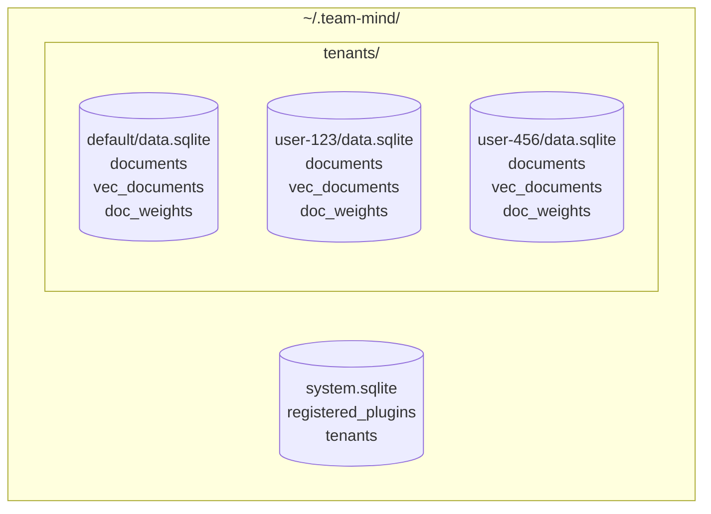
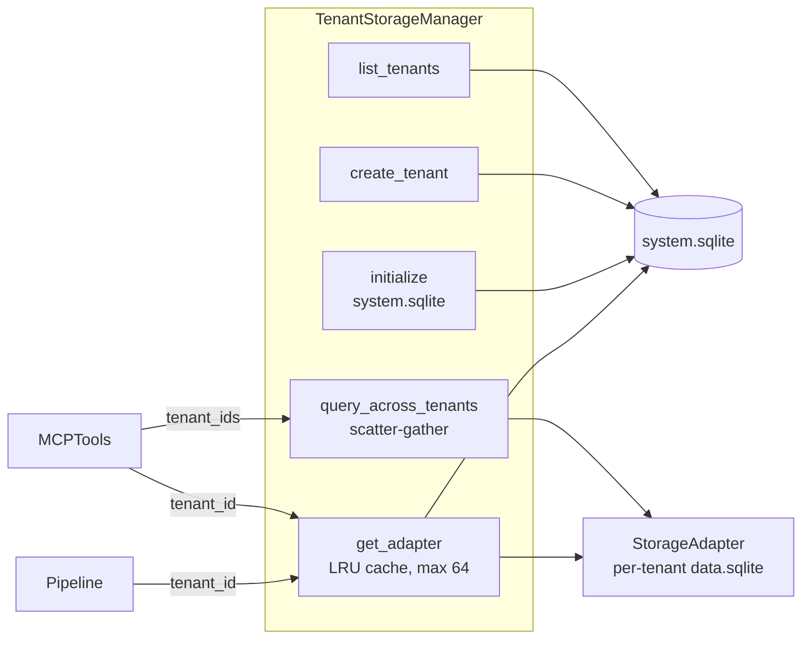
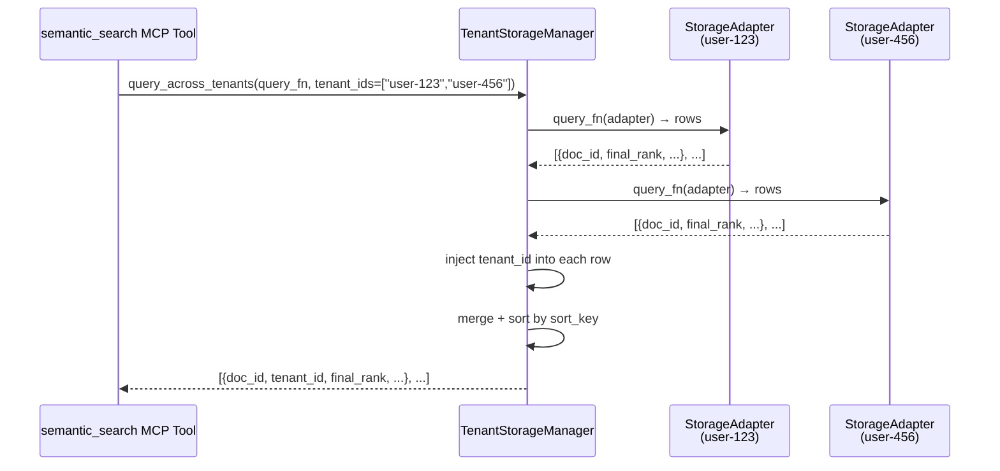
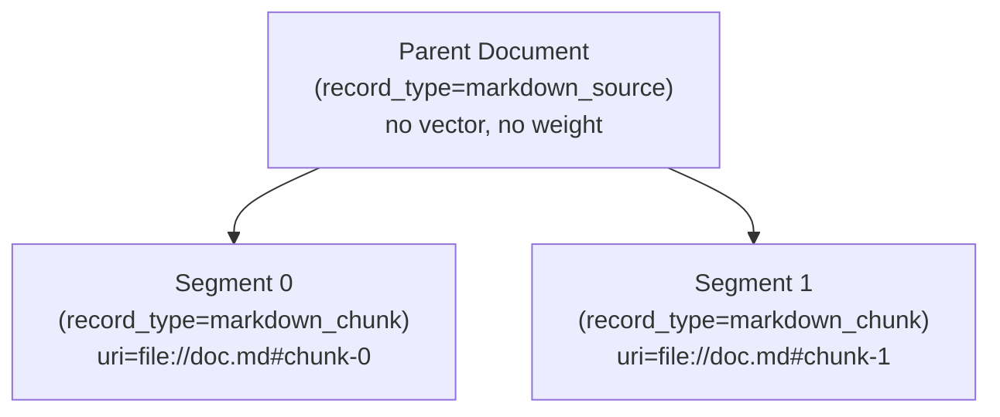

# System Architecture Overview

> **Building a plugin?** Start with the [Plugin Developer Guide](plugin-developer-guide.md) — it covers what you own, what the platform provides, and how to build with both storage modes.

## Design Philosophy

The core philosophy of "Team Mind" is to provide an intelligent, token-optimized, and highly extensible enterprise knowledge base. Moving beyond traditional "dumb" RAG (Retrieval-Augmented Generation) which relies solely on text chunking and semantic fuzziness, this system embraces a **Structured, Pluggable Architecture**. 

It prioritizes:
1. **Token Optimization & Precision:** Giving AI agents exactly the structural information they need (e.g., AST signatures) rather than raw, noisy files.
2. **Deterministic Retrieval:** Allowing agents to invoke explicit tools for specific data types instead of relying on unpredictable semantic search for everything.
3. **Rich, Multipronged Ingestion:** A single source file or resource can be processed by multiple specialized plugins to extract diverse layers of value (semantics, metrics, structural graphs).

## Project Structure & Architecture

The system is decomposed into three primary layers:

### 1. The Gateway Layer (MCP Server)
The universal entry point for the system is a **Model Context Protocol (MCP) Server**.
- It acts as the Host/Router that registers tools exposed by the underlying plugins.
- It normalizes the interface so that any MCP-compliant client (Claude, Cursor, custom agents) can seamlessly interact with the enterprise knowledge base.
- **Dynamic plugin management:** Plugins can be registered and unregistered at runtime via `register_plugin` / `unregister_plugin` MCP tools, without restarting the server. Core plugins (Markdown, Retrieval, etc.) are bundled; additional plugins are loaded dynamically from Python module paths and persisted across restarts.
- For non-MCP human interfaces (like MS Teams bots), a lightweight "Router API" (potentially backed by a fast LLM) will act as an intermediary client to query the MCP server on the human's behalf.

### 2. The Ingestion Pipeline (Semantic Routing & Validation)
Ingestion is treated as a systemic, multi-stage event rather than a simple database write.
- **Resource Bundles & URIs:** The system abstracts incoming data as "Resources" identified by URIs (e.g., `file://`, `https://`, `confluence://`), not just local files. A "Bundle" contains one or more of these Resources.
- **Dual-Mode Storage (Pointers + Embedded Content):** Each document row supports two retrieval modes. **Pointer mode:** the row stores a URI reference; when an AI requests the full document, a Resolver fetches it live from the source (`file://`, `https://`, etc.). This prevents data duplication at enterprise scale. **Embedded mode:** the full content is stored directly in the row's `metadata` JSON under `local_payload`; retrieval is instantaneous with no external dependency. Plugins choose per-document which mode to use at ingestion time — both are first-class, and a single knowledge base freely mixes them. Embedded mode is essential for ephemeral content (uploaded text, chat transcripts, API responses) that has no stable external URI.
- **Semantic Type Routing (SPEC-008):** Processors are no longer broadcast to unconditionally. The ingestion caller specifies `semantic_types` (e.g., `["architecture_docs"]`), and the pipeline routes the bundle only to `IngestProcessor` plugins registered for those types. Within a routed bundle, plugins additionally filter by their declared media type capabilities — a MarkdownPlugin only receives `.md` files even when routing is via `["*"]`. See the [Three-Type Model](#three-type-model) section below.
- **Phase 1 — Processing:** When a Bundle is ingested, the pipeline routes it to matching `IngestProcessor` plugins in parallel. Each processor parses the bundle, extracts domain-specific value (e.g., parsing code ASTs, vectorizing text, extracting facts), writes to storage, and returns structured `IngestionEvent` objects describing what was written.
- **Phase 2 — Observation:** After all processors complete, the collected `IngestionEvent` objects are broadcast to all registered `IngestObserver` plugins. Observers react to completed ingestion — auditing, notifications, cross-plugin triggers — without processing raw URIs. Observers are guaranteed to see the final committed state. EventFilter now supports `semantic_types` filtering.
- **Reliability Seeding (SPEC-007 — implemented):** The original inline Librarian concept has been retired (ADR-006). Reliability is addressed via three-layer score seeding at ingestion time: (1) caller-supplied `reliability_hint` passed through `ingest_documents` or `--reliability` CLI flag; (2) plugin-declared `RecordTypeSpec.default_reliability`; (3) platform default of `0.0`. Plugins resolve these layers in `process_bundle` and pass the result as `initial_score` to `save_payload`, which seeds `usage_score` in `doc_weights`.
- **Future: Background Conflict Detection:** An asynchronous background reaper will scan for near-duplicate content across different URIs and cross-document contradictions (semantic deduplication + contradiction detection). *(Future — see ADR-006)*

### 3. The Plugin Architecture (Renderers/Processors)
Plugins are specialized engines that handle both the ingestion parsing of resources and the registration of retrieval tools to the MCP Server.
- **Example Plugins:**
  - *Markdown/Text Plugin:* Handles semantic vectorization and keyword search. (Registers tool: `search_knowledge_base`)
  - *Document Retrieval Plugin:* Dedicated plugin for fetching raw content. Can retrieve from local DB storage or live URIs. (Registers tool: `get_full_document`)
  - *AST/Code Plugin:* Parses code into structural relationships. (Registers tools: `get_class_signature`, `get_method`)
  - *Metrics Plugin:* Analyzes code churn or complexity during ingestion. (Registers tool: `get_file_metrics`)

## Three-Type Model

SPEC-008 (ADR-007) introduces three distinct type concepts for all data in the system:

| Type | What it answers | Set by | Example |
|------|----------------|--------|---------|
| **Semantic type** | "What does this data *mean*?" | Ingestion caller | `architecture_docs`, `payment_service` |
| **Media type** | "How is this data *encoded*?" | Plugin / auto-detected | `text/markdown`, `text/x-java` |
| **Record type** | "What did the plugin *produce*?" | Plugin, at write time | `markdown_chunk`, `code_signature` |

Record type replaced the earlier `doctype` field (renamed in SPEC-009).

### Activation Model

Registered plugins exist in one of two operational states:

- **Available:** Plugin is registered, its tools are active and discoverable — but it has no semantic type associations, so it receives no ingestion traffic.
- **Enabled:** Plugin has one or more semantic types configured (`["architecture_docs"]` or `["*"]` for wildcard). It processes ingestion bundles for those types, subject to its media type capabilities.

This model ensures that newly installed plugins don't silently process all content. Activation requires an explicit admin action — associating semantic types with the plugin at registration time or via `update_plugin_semantic_types`.

## Multi-Tenancy & Metadata Search (SPEC-010)

### Tenant Sharding Architecture

Every document belongs to exactly one tenant. Tenancy is implemented at the **SQLite file level** — each tenant gets its own database file. This means KNN vector search operates on exactly the right dataset by construction, avoiding the selectivity problem that plagues column-based tenant filtering.



**Key rules:**
- `system.sqlite` holds plugin registry (`registered_plugins`) and tenant directory (`tenants`). Plugins are global — registered once, available to all tenants.
- Each tenant's `data.sqlite` holds `documents`, `vec_documents`, and `doc_weights`. No `tenant_id` column — the file *is* the tenant scope.
- The default tenant `"default"` is auto-created on startup. Single-tenant deployments use it and never think about sharding.

### TenantStorageManager

`TenantStorageManager` owns all per-tenant database lifecycle. Plugins and pipelines interact with it to obtain per-tenant `StorageAdapter` instances — they never open database connections directly.



**Responsibilities:**
- Opens `system.sqlite` and ensures `registered_plugins` and `tenants` tables exist on `initialize()`.
- `get_adapter(tenant_id)` opens the tenant's `data.sqlite` lazily on first access and caches it (LRU eviction, max 64 open connections). Raises `ValueError` for unregistered tenants.
- `create_tenant(tenant_id)` registers the tenant in `system.sqlite` and creates the tenant directory. Idempotent.
- `IngestionPipeline` auto-creates unregistered tenants on ingest (try → `ValueError` → create → retry).
- `query_across_tenants` implements scatter-gather: runs `query_fn` on each shard sequentially, injects `tenant_id` into each result dict, merges and re-sorts.

### Scatter-Gather Query Flow



**Sort direction:** `sort_descending=False` for vector queries (lower `final_rank` = better distance), `sort_descending=True` for weight-only queries (higher `weight_rank` = better score).

When `tenant_ids` is omitted, the tool queries all registered tenants (full scatter-gather). Every result dict always includes `tenant_id` for consistent output.

### Metadata Search

The `metadata` JSON column is now queryable at search time through optional filter parameters on `retrieve_by_vector_similarity` and `semantic_search`:

```python
metadata_filters = {"interest_category": "sports", "league": "nfl"}
# → WHERE json_extract(d.metadata, '$.interest_category') = 'sports'
#     AND json_extract(d.metadata, '$.league') = 'nfl'
```

Metadata filter keys are validated against `^[A-Za-z0-9_]+$` before SQL interpolation to prevent injection. Filters compose with existing `plugin` and `record_type` filters.

**Vector query is optional.** When `query` is omitted from `semantic_search`, results are ranked by composite weight score (`usage_score * decay`) descending — enabling pure metadata queries without semantic similarity.

### Structural Fields vs. Metadata Fields

| | First-class columns | Metadata fields |
|---|---|---|
| **Purpose** | Framework routing, identity, and system behavior | Domain-specific attributes for query-time filtering |
| **When used** | Ingestion-time routing + query-time filtering | Query-time filtering only |
| **Who controls** | Framework / pipeline | Plugins / domain logic |
| **Examples** | `plugin`, `record_type`, `semantic_type`, `media_type` | `interest_category`, `league`, `destination`, `price_range` |
| **Indexed** | Dedicated B-tree indexes | `json_extract` (per-query) |

**The rule:** If the framework/pipeline needs it to make routing or identity decisions, it's a column. If only consumers need it at query time for filtering, it belongs in `metadata`.

## Document Segments (SPEC-011)

SPEC-011 (ADR-009) introduces a formal **parent-child relationship** on the `documents` table, formalizing the micro-document pattern that MarkdownPlugin and other chunking plugins already follow.

### Segment Model



- **Parent documents** (`parent_id = NULL`, no children vector/weight): logical containers that hold document-level metadata. Never appear in KNN search — no vector embedding. Score is derived as the average of non-tombstoned children's `usage_score` at query time.
- **Segments** (`parent_id = <doc_id>`): independently searchable and ratable atoms. Each has its own URI, vector, and `doc_weights` row.

### Schema Addition

```sql
ALTER TABLE documents ADD COLUMN parent_id INTEGER REFERENCES documents(id);
CREATE INDEX idx_documents_parent_id ON documents(parent_id);
```

`parent_id = NULL` (the default) means the row is either a standalone document or a parent. All existing plugins continue to work without changes.

### Cascade Deletes

`delete_by_uri` on a parent automatically deletes all child segments, their vectors, and their weight rows. Deleting a single segment removes only that segment — the parent and siblings are unaffected.

## Key Architectural Decisions

1. **Client-Side Orchestration:** The MCP Server does not need a heavy internal orchestrating LLM for retrieval. It exposes all plugin tools to the AI client, allowing the client (Claude/Cursor) to orchestrate its own deterministic tool calls.
2. **Reliability Seeding (replaces Librarian):** Rather than a synchronous inline Librarian gatekeeper, reliability is seeded at ingestion time via a three-layer model (caller hint → plugin default → 0.0). High-quality sources rank higher immediately; the platform's scoring system handles refinement over time via feedback signals.
3. **Embedded Relational/Document Storage (MVP):** Phase 1 skips flat files and avoids massive MongoDB deployments by utilizing an embedded database (e.g., SQLite with JSON/Vector extensions, or DuckDB). Modern SQLite provides native JSON document views (`JSONB`), allowing us to store and query arbitrary plugin metadata/documents just like MongoDB, alongside vector embeddings, entirely in process.
4. **Tenant Sharding at File Level (SPEC-010):** Each tenant gets its own SQLite file. KNN vector search operates on exactly the right dataset by construction — no post-filter selectivity problem. `TenantStorageManager` owns all cross-tenant lifecycle. Plugins operate on a single `StorageAdapter` and are completely unaware of tenancy. See [ADR-010](ADRs/ADR-010-tenant-sharding.md).
5. **Document Segments (SPEC-011):** The micro-document pattern (one row per ratable knowledge atom) is formalized with an explicit `parent_id` column. Parents provide grouping context and aggregate scoring; segments are the searchable, independently-weighted units. Backward compatible — existing plugins are unaffected. See [ADR-009](ADRs/ADR-009-document-segments.md).
